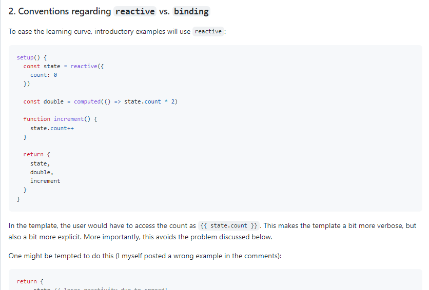
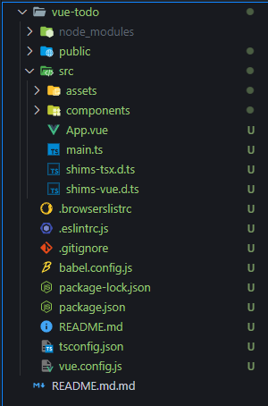
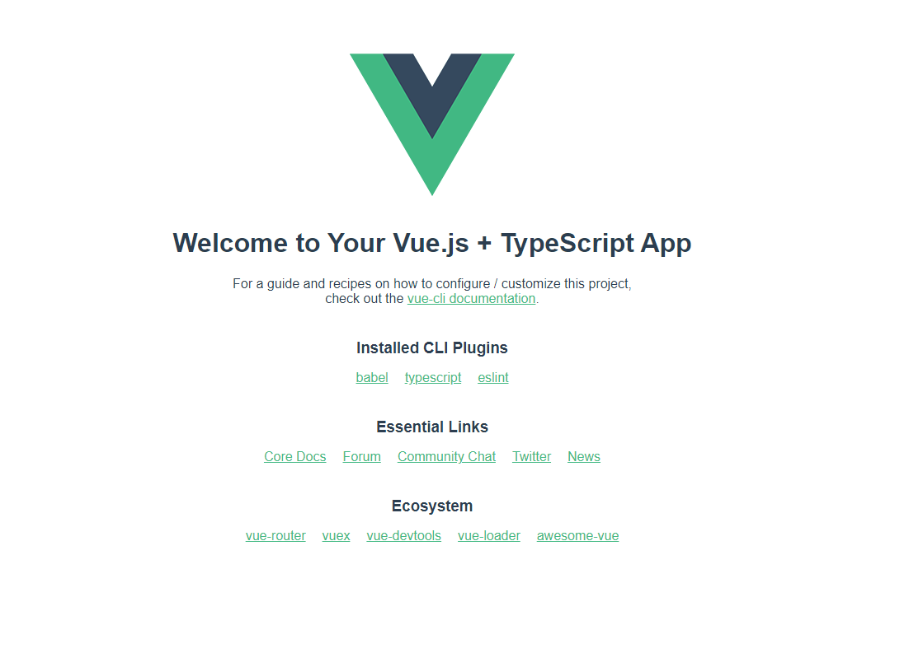

# 첫 번째 프로젝트 시작하기

## Vue.js 타입스크립트 프로젝트 생성

```shell
vue create vue-todo
```

vue 버전 : Vue2

Vue3를 라이브러리 호환문제나 쓰면서 계속 바뀔 수 있기 때문에 Vue2로 진행


### 개발 환경 설정

타입스크립트 구성 시 Vue/Cli에서 제공하는 타입스크립트를 이용하는 것을 추천.

[참고](https://joshua1988.github.io/web-development/vuejs/boost-productivity/)

> ? Please pick a preset: Manually select features
> ? Check the features needed for your project: Babel, TS, Linter
> ? Choose a version of Vue.js that you want to start the project with 2.x
> ? Use class-style component syntax? No
> ? Use Babel alongside TypeScript (required for modern mode, auto-detected polyfills, transpiling JSX)? Yes
> ? Pick a linter / formatter config: Prettier
> ? Pick additional lint features: Lint on save
> ? Where do you prefer placing config for Babel, ESLint, etc.? In dedicated config files
> ? Save this as a preset for future projects? (y/N) n

설정 파일은 별도의 파일로 관리하는게 확장성 있게 프로젝트를 관리할 수 있다.


## TS 클래스 문법을 권장하지 않는 이유

### Update : Class API proposal is being dropped

Class API를 들고가지 않겠다.


https://github.com/vuejs/rfcs/pull/17

RFC(Request For Comment) : 신규 개발들을 어떻게 해 나갈건데 그에 대한 의견을 달라는 것.


Vue3에서 setup()



setup이란  vue3에 추가된 인스턴스 옵션.

정리하자면 앞으로의 Vue3에서 Class API가 없을 것이다. => 호환이 안되는건 아니지만, 뭔가 더 개선되진않을 것.

**참고**

- https://github.com/vuejs/rfcs/pull/17
- https://github.com/vuejs/rfcs/pull/42
- https://github.com/vuejs/rfcs/issues/63


## 강의 진행 방식 및 첫 번째 프로젝트 소개

### Vue.js에서 타입스크립트를 적용하는 방법

1.처음 서비스를 구축할 때 부터 타입스크립트를 사용.

2.기존에 이미 구현된 서비스에 타입스크립트를 점진적으로 적용.


## 프로젝트 설명



* package.json: 구성 내용을 확인.

* tsconfig.json: 프로젝트에서 어떤식으로 해석해 나갈지에 대한 옵션들.<br/>[tsconfig 참고](https://www.typescriptlang.org/tsconfig)<br/>위 파일들에 적힌 구성내용들을 미리 만들어 주기 때문에 CLI에서 설정된 typescript사용을 추천.
* jsconfig.json는 vscode내부적으로 사용될 설정 파일, <br/>ex) jsconfig로 @/했을 때 경로를 찾아나가는 자동화 기능들.<br/>tsconfig는 타입스크립트 설정파일이기도 하면서, vscode내부에서 파일을 인식해서 부가적인 기능을 제공해 준다.
* .eslintrc.js : lint설정 파일
* **main.ts** : 기존의 main.js에서 main.ts로 바뀐 것
* **shims-vue.d.ts** : <br/>타입스크립트가 프로젝트를 보고 해석(파일들의 관계해석이나 타입추론)하는데, 타입스크립트 입장에서 vue파일이 뭔지 모를 수 있다.<br/>이 파일에서 ".vue"라는 파일을 모두 안의 내용으로 해석해달라는 파일<br/>

```shell
declare module "*.vue" {
  import Vue from "vue";
  export default Vue;
}
```

❗ 터미널에서 `code .`이 안되면 명령어 팔레트에서 install code.

이후 npm run serve로 확인.


