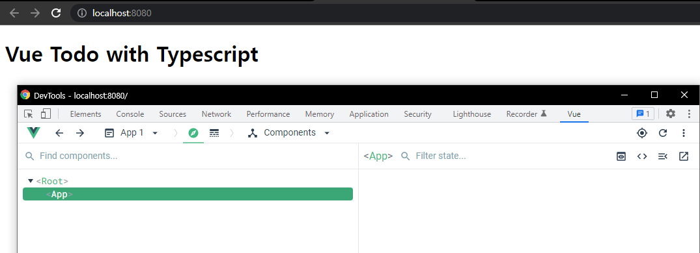
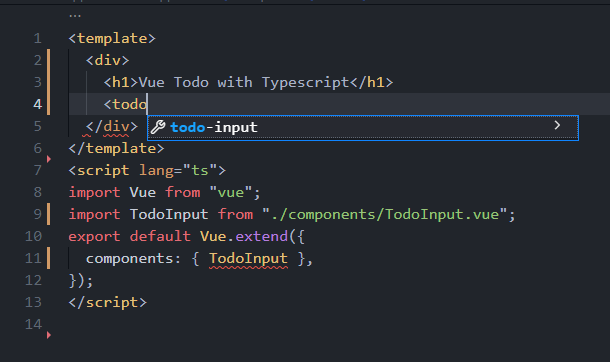
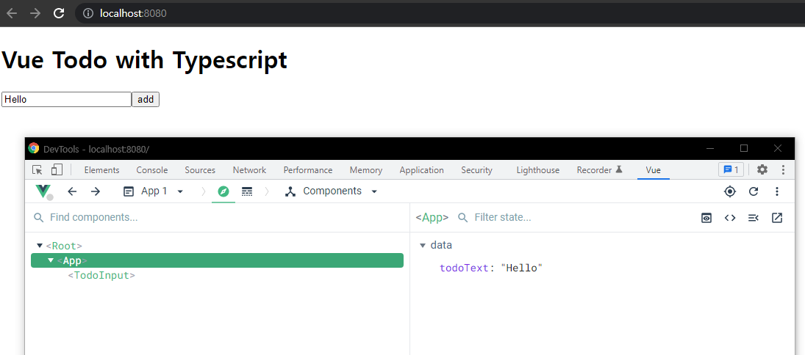
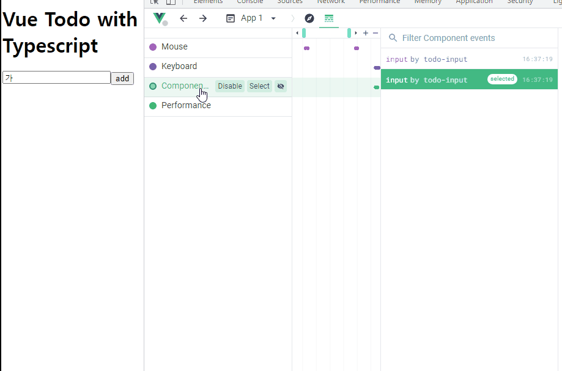

할 일 관리 앱 - 추가 기능 구현

## 구현할 기능 리스트업 및 부 TS 컴포넌트 단축키 안내

### 만들 기능 목록 (CRUD)

로컬 스토리지를 이용해 진행

* 할 일 조회
* 할 일 추가
* 할 일 삭제
* 할 일 수정


vetur에서 vu를 입력해 자동완성 하던것을 이제는 `ts`명령어를 이용해 자동완성.

```vue
// App.vue
<script lang="ts">
import Vue from 'vue'
export default Vue.extend({
  
})
</script>
```




## 인풋 컴포넌트 생성 및 등록

### 이전 방식

```vue
<div>
	<label for=""></label>
    <input type="text"/>
    <button></button>
</div>
```

이런 식으로 하나하나 다써왔지만, 컴포넌트를 따로 만들어 진행.

```vue
// components/TodoInput.vue

<template>
  <div>
    <label for="todo-input"></label>
    <input id="todo-input" type="text" />
    <button @click="addTodo" type="button">add</button>
  </div>
</template>
<script lang="ts">
import Vue from "vue";
export default Vue.extend({
  methods: {
    addTodo() {
      console.log("ADD");
    },
  },
});
</script>
```

todoInput을 입력하려고 할때 자동완성되는 것을 볼 수 있다.



```vue
// App.vue
<template>
  <div>
    <h1>Vue Todo with Typescript</h1>
    <todo-input></todo-input>
  </div>
</template>
<script lang="ts">
import Vue from "vue";
import TodoInput from "./components/TodoInput.vue";
export default Vue.extend({
  components: { TodoInput },
});
</script>
```


input에 들어갈 값들을 정의 해주어야함.

### ❗ Delete `␍` prettier/prettier 해결 방법

진행도중 이런 에러가 발생했는데 eslint설정 파일을 수정해주면 된다.

```javascript
rules: {
    "prettier/prettier": [
      "error",
      {
        endOfLine: "auto",
      },
    ],
  },
```

rules에 해당 부분을 추가해주면 해결된다. (안된다면 vscode를 재실행하면 될 것임.)


## 인풋 컴포넌트에 내려줄 data와 props속성 정의

props로 item을 내려 해당 todoText를 내려보내줄 것이다.

```vue
// App.vue
<todo-input :item="todoText"></todo-input>
```


```vue
// TodoInput
<input id="todo-input" type="text" :value="item" />
...
<script lang="ts">
import Vue from "vue";
export default Vue.extend({
  props: ["item"],
    ...
</script>
```



편집기를 이용해 App에서 todoText를 수정하면 props로 내려받은 TodoInput위치에 값이 들어가는 것을 볼 수있다.


## 인풋 컴포넌트의 emit 이벤트 정의 및 구현

props에대한 값에 대해서 위로 다시 올려주는 기능구현을 해보자.

**how?**

input event를 잡아서 다시 올려보내줄 것이다.

❗ 작성중 event에 error가 날 것인데 그 부분은 noImplicitAny가 true이기 때문.<br/>(strict: 'true'인데 그안에 noImplicitAny가 있다.)<br/>event타입을 일단 any로 두면 해결됨.

```vue
// TodoInput.vue
<template>
  <div>
    <label for="todo-input"></label>
    <input id="todo-input" type="text" :value="item" @input="handleInput" />
    <button @click="addTodo" type="button">add</button>
  </div>
</template>
<script lang="ts">
import Vue from "vue";
export default Vue.extend({
  props: ["item"],
  methods: {
    handleInput(event: any) {
      this.$emit("input", event.target.value);
    },
    addTodo() {
      console.log("ADD");
    },
  },
});
</script>

```

input이벤트가 일어나는 것을 확인할 수 있다.




```vue
// App.vue
<todo-input :item="todoText" @input="updateTodoText"></todo-input>
...

methods: {
    updateTodoText(value: any) {
      this.todoText = value;
    },
  },
```

updateTodoText로 다시 받게되면 v-model과 같은 효과가 나타난다.


## 할 일 추가 버튼 기능 구현

add버튼을 누르면 로컬스토리지에 저장되는 기능을 구현할 것이다.

```vue
// TodoInput.vue
<template>
  ...
    <button @click="addTodo" type="button">추가</button>
  ...
</template>
<script lang="ts">
...
    addTodo() {
      this.$emit("add");
    },
  },
});
</script>

```

Todo Input에서 버튼을 클릭 했을 때 emit으로 올려준다.


```vue
// App.vue
<template>
	...
     <todo-input
          :item="todoText"
          @input="updateTodoText"
          @add="addTodoItem"
     ></todo-input>
</template>
<script lang="ts">
    ...
    addTodoItem() {
      const value = this.todoText;
      localStorage.setItem(value, value);
      this.initTodoText();
    },
    initTodoText() {
      this.todoText = "";
    },
</script>
```

App.vue에서는 add를 받게되면, localStorage에 todoText값을 로컬스토리지에 저장하고, initTodoText메소드를 통해 초기화 시켜준다.


## v-model을 풀어서 구현하는 방식의 장점

❗**v-model을 사용하게되면, 한글에 대한 반응이 늦다**

여러개를 사용한 form이 있다고 생각해보자.

```vue
<form>
	<TodoInput :item="todoText" ...></TodoInput>
	<TodoInput :item="password" ...></TodoInput>
    ...
</form>
```

공통 validation에 대한 관리가 편해진다.

[v-model 참고](https://joshua1988.github.io/web-development/vuejs/v-model-usage/)

### v-model

v-model은 v-bind와 v-on의 조합으로 동작함.

* v-bind : 뷰 인스턴스의 데이터 속성을 해당 HTML 요소에 연결할 때 사용한다.
* v-on : 해당 HTML 요소의 이벤트를 뷰 인스턴스의 로직과 연결할 때 사용한다.
* 사용자 이벤트에 의해 실행된 뷰 메서드(methods) 함수의 첫 번째 인자에는 해당 이벤트(`event`)가 들어온다.


뷰 공식 문서에서는 한국어 입력을 다룰 때 `v-bind:value`와 `v-on:input`를 [직접 연결해서 사용하는 것을 권고하고](https://vuejs.org/v2/guide/forms.html#Basic-Usage) 있습니다.

인풋 컴포넌트를 별도의 컴포넌트로 분리하면 `v-model`로 편하게 처리할 수 있습니다.

```vue
<!-- BaseInput.vue - 싱글 파일 컴포넌트 구조-->
<template>
  <input v-bind:value="value" v-on:input="updateInput">
</template>

<script>
export default {
  props: ['value'],
  methods: {
    updateInput: function(event) {
      this.$emit('input', event.target.value);
    }
  }
}
</script>
```

* `props`로 받은 `value`를 인풋 태그에 값으로 연결
* 인풋 태그에서 값이 입력되면 인풋 태그에서 `input` 이벤트가 발생하고 `updateInput` 메서드가 실행
* `pdateInput` 메서드에서 인풋 태그에 입력된 값을 상위 컴포넌트에 `input` 이벤트로 올려 보냅니다

```vue
<!-- App.vue - 싱글 파일 컴포넌트 구조 -->
<template>
  <div>
    <base-input v-model="inputText"></base-input>
  </div>
</template>

<script>
import BaseInput from './BaseInput.vue';

export default {
  components: {
    'base-input': BaseInput
  },
  data: function() {
    return {
      inputText: ''
    }
  }
}
</script>
```

 `v-model` 속성에 연결한 값이 하위 컴포넌트에 `value` 라는 프롭스 속성으로 내려간다는 사실을 추론할 수 있습니다.


## 인풋 컴포넌트 프롭스 속성 유혀성 검사 및 타입 정의

props에 대한 타입정의

```vue
// TodoInput.vue
...

props: {
    items: {
      type: String,
      required: true,
    },
  },
...
```


handleInput의 경우 console로 찍게 되면, InputEvent가 발생한 것을 볼 수 있다.

```vue
handleInput(event: InputEvent) {
	console.log(event);
	this.$emit("input", event.target.value);
},
```

emit부분에 에러가 발생하는데 event.target이 null일수도 있는데 바로 접근했다는 에러이다.

null이 아닌 것을 보장해주어야한다.

* non-null assertion type<br/>` this.$emit("input", event.target!.value);`

* null 체크<br/>`if(!event.target){return ;}`<br/>value에서 또다시 에러가 발생함.
* **타입 단언**<br/>`const eventTarget = event.target as HTMLInputElement;`<br/>console로 찍은 event에서 target이 HTMLInputElement인 것을 확인했었다.<br/>그렇기 때문에 unsafe하지만, 이런식으로 타입단언을 사용할 수 있다.

```vue
handleInput(event: InputEvent) {
    console.log(event);
    const eventTarget = event.target as HTMLInputElement;
	this.$emit("input", eventTarget.value);
},
```

eventTarget.value가 string으로 추론된 것이 보인다.

```vue
// App.vue
updateTodoText(value: string) {
	this.todoText = value;
},
```

App.vue에서 value의 타입을 수정해 줄 수 있다.


## Vetur 플러그인의 컴포넌트 태그 자동 완성 설정

[Vetur옵션 안내](https://vuejs.github.io/vetur/guide/setup.html#vs-code-config)

### Vetur TagCasing

별도 설정이 없으면 kebob => initial로 변경하면 케밥형태가 아니게 변경될 것이다.

todo-input => TodoInput


