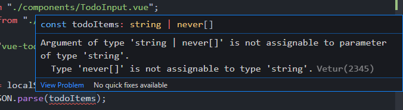
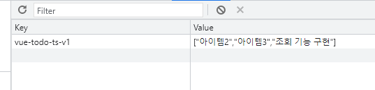
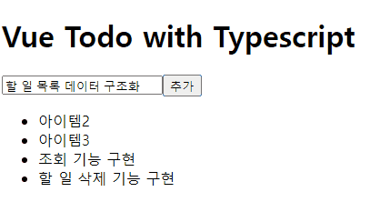

# 할 일 관리 앱 - 조회 기능 구현

## 할 일 아이템 목록 컴포넌트 설계 및 구현

```html
header
	h1
main
	TodoInput
	list
```

구조로 갈 예정.


리스트 아이템에 대한 컴포넌트 파일 작성.

```vue
// TodoListItem.vue
<template>
  <li>아이템1</li>
</template>
<script lang="ts">
import Vue from "vue";
export default Vue.extend({});
</script>
```


```vue
// App.vue
<template>
  <div>
    <header>
      <h1>Vue Todo with Typescript</h1>
    </header>
    <main>
      <TodoInput
        :item="todoText"
        @input="updateTodoText"
        @add="addTodoItem"
      ></TodoInput>
      <div>
        <ul>
          <TodoListItem>item 1</TodoListItem>
        </ul>
      </div>
    </main>
  </div>
</template>
<script lang="ts">
import Vue from "vue";
import TodoInput from "./components/TodoInput.vue";
import TodoListItem from "./components/TodoListItem.vue";
export default Vue.extend({
  components: { TodoInput, TodoListItem },
 ...
});
</script>
```


## 데이터 조회 API 설계

로컬스토리지 데이터를 꺼내서 TodoListItem에 연결.

```vue
const storage = {
  fetch(){ ... }
}
```

localStorage에서 데이터를 가져와 사용하려는 형태로 가공하는 메소드.

```vue
const STORAGE_KEY = "vue-todo-ts-v1";
const storage = {
  fetch() {
    const todoItems = localStorage.getItem(STORAGE_KEY) || [];
    const result = JSON.parse(todoItems);
    return result;
  },
};
```


## 데이터 조회 API 타입 에러와 JSON 파싱 에러 해결

현재 todoItems에 타입에러가 발생한다.



string이나 never[]라는 배열타입이 string에 할당될 수 없다는 에러.

뒤의 기본값 배열을 문자열로 변경하면 일단 해결.

```vue
const todoItems = localStorage.getItem(STORAGE_KEY) || "[]";
```

fetchTodoItems메서드를 추가.

```vue
fetchTodoItems() {
      storage.fetch();
    },
```

현재 타입을 보면 any로 나온다. 그 이유는 return되는 result가 any이기 떄문.

todoItems를 추가하여 연결.

```vue
data() {
    return {
      todoText: "",
      todoItems: [],
    };
  },
methods:{
	...
	fetchTodoItems() {
      this.todoItems = storage.fetch();
    },
}
```

this.todoItems의 타입은 never[]로 되있는데 그 이유는 data에서 todoItems를 일반배열로 초기화 했고, 무슨 타입을 가진다고 선언하지 않았기 때문.


## 할 일 추가 API 설계 및 구현

addTodoItem에서 로컬스토리지에 value를 key,value로 똑같이 그대로 넣고있다.

해당 부분을 storage에서 작성.

```vue
const STORAGE_KEY = "vue-todo-ts-v1";
const storage = {
  save(todoItems: any[]) {
    localStorage.setItem(STORAGE_KEY, todoItems);
  },
  fetch() {
    const todoItems = localStorage.getItem(STORAGE_KEY) || "[]";
    const result = JSON.parse(todoItems);
    return result;
  },
};
```


우리가 넣으려는 값이 key, 배열 이기 때문에, 기존의 addTodoItems를 변경.

todoItems의 타입을 일단 as any[]로 지정하여 타입에러를 잡는다.

```vue
data() {
    return {
        todoText: "",
        todoItems: [] as any[],
    };
},
methods: {
	...
    addTodoItem() {
        const value = this.todoText;
        this.todoItems.push(value);
        storage.save(this.todoItems);
        // localStorage.setItem(value, value);
        this.initTodoText();
    },
	...
},
```


save의 todoItems는 배열을 직렬화해주어야한다.

```vue
const storage = {
  save(todoItems: any[]) {
    const parsed = JSON.stringify(todoItems);
    localStorage.setItem(STORAGE_KEY, parsed);
  },
  fetch() {
    const todoItems = localStorage.getItem(STORAGE_KEY) || "[]";
    const result = JSON.parse(todoItems);
    return result;
  },
};
```

이렇게 되면 어떤 항목을 추가할 때마다 배열에 항목이 추가가 되고, 추가된 배열이 직렬화되어 value로 들어가게 될것임.


추가 버튼을 누를때 마다 해당 항목이 Value에 추가되는 것을 볼 수 있다.




## 할 일 조회 기능 구현

fetch를 이용해 화면에 할일 목록을 표시해보자.

todoItems에 스토리지에서 가져온 목록이 있을 거고, 그 목록을 가지고 반복을 통해 표시.

```vue
// App.vue
<template>
  <div>
    <header>
      <h1>Vue Todo with Typescript</h1>
    </header>
    <main>
      <TodoInput
        :item="todoText"
        @input="updateTodoText"
        @add="addTodoItem"
      ></TodoInput>
      <div>
        <ul>
          <TodoListItem
            v-for="(todoItem, index) in todoItems"
            :key="index"
            :todoItem="todoItem"
          ></TodoListItem>
        </ul>
      </div>
    </main>
  </div>
</template>
<script lang="ts">
	...
</script>

```


```vue
// TodoListItem.vue
<template>
  <li>{{ todoItem }}</li>
</template>
<script lang="ts">
import Vue from "vue";
export default Vue.extend({
  props: {
    todoItem: String,
  },
});
</script>
```

❗ 작성시 해당 컴포넌트에 먼저 props를 작성하면 사용하는 화면에서 props에 내려야하는 것을 자동완성 해줌.


### 결과

