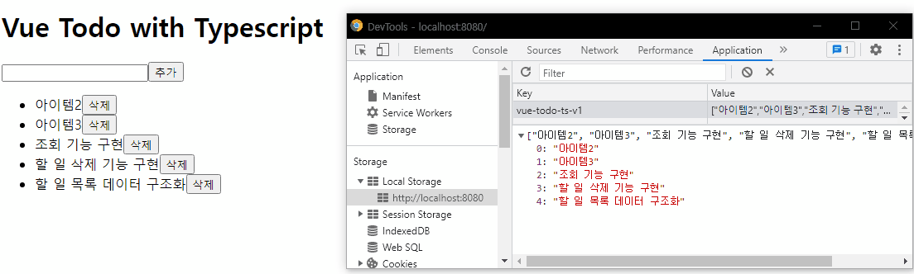

# 할 일 관리 앱 - 삭제 기능 구현

## 삭제 기능 마크업 및 이벤트 연동

컴포넌트 내부에서 처리할 수 있는 걸 굳이 vuex에서는 하지말자.

 삭제기능을 위한 method를 만들자.

```vue
// TodoListItem.vue
<template>
  <li>
    <span>{{ todoItem }}</span>
    <button @click="$emit('delete')">삭제</button>
  </li>
</template>
<script lang="ts">
import Vue from "vue";
export default Vue.extend({
  props: {
    todoItem: String,
  },
});
</script>
```

삭제버튼을 만들고 클릭 시 emit으로 올림.

```vue
<template>
...
<TodoListItem
	v-for="(todoItem, index) in todoItems"
    :key="index"
	:todoItem="todoItem"
	@delete="removeTodoItem"
></TodoListItem>
...
</template>
<script>
removeTodoItem() {
    console.log("remove");
},
</script>
```


메소드를 완성해보자

우선 index를 props로 내리고, 선택한 index를 removeTodoItem에서 index를 받는다.

```vue
...
<TodoListItem
	v-for="(todoItem, index) in todoItems"
    :key="index"
    :index="index"
    :todoItem="todoItem"
    @remove="removeTodoItem"
></TodoListItem>
...

removeTodoItem(index: number) {
	console.log("remove", index);
},

// TodoListItem
...
<script lang="ts">
import Vue from "vue";
export default Vue.extend({
  props: {
    todoItem: String,
    index: Number,
  },
  methods: {
    removeItem() {
      this.$emit("remove", this.index);
    },
  },
});
</script>

```


## 할 일 삭제 API 연동 및 구현

```vue
removeTodoItem(index: number) {
	console.log("remove", index);
	this.todoItems.splice(index, 1);
	storage.save(this.todoItems);
},
```

splice를 이용해 잘라내고, storage.save로 다시 덮어씌운다.


### 결과

