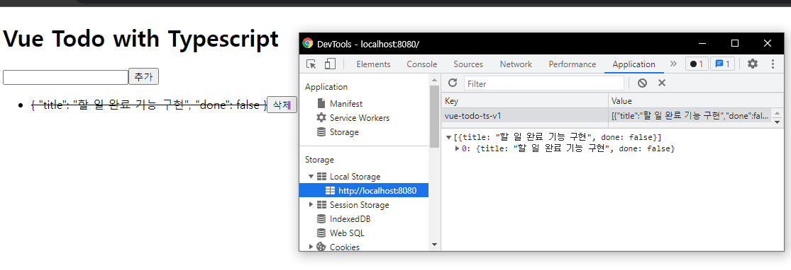
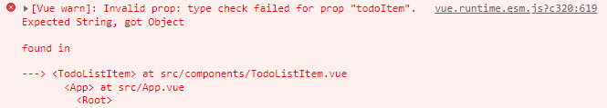
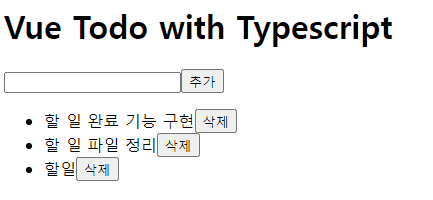

# 할 일 관리 앱 - 완료 기능 구현

## 할 일 완료 기능 마크업 및 스타일링

todoItems를 받는 곳 부터 타입들이 모든 메서드와 하위 컴포넌트를 관통하면서 일괄적으로 적용되는걸 보며 타입스크립트의 장점을 느낄 수 있다.

마크업과 스타일링을 먼저하자.

할 일 목록을 클릭하면 line-through를 추가하며 클래스를 동적으로 줄 예정.<br/>('~~할일 완료 기능~~' 이런식으로)

```css
<style scoped>
.item {
  cursor: pointer;
}
.complete {
  text-decoration: line-through;
}
</style>
```

> ❗ cup => cursor: pointer | tdl => text-decoration: line-through;
>
> 이런 식으로 자동완성 가능.


## 할 일 목록의 데이터 타입 정의 및 할 일 추가 기능에 적용

유의미하게 구조를 바꿔보자.

save를 살펴보면 text만 push하고있다.

todoItems의 타입을 지정하면 `this.todoItems.value`는 에러가 날것이다.

interface 를 만들어보자. ( ❗ 인터페이스는 객체를 위한 타입)

```vue
interface Todo {
  title: string;
  done: boolean;
}
```


그리고 기존의 todoItems에 as로 타입단언을 해놓았던 것을 Todo로 변경.

```vue
todoItems: [] as Todo[]
```

>❗ 타입 정의시 초기화를 할 때 as를 써서 초기화를 시켜준다.

이제 add에서 value에 에러가뜨는 것을 확인할 수 있다. (string을 넣기 때문)

```vue
addTodoItem(){
...
	const todo: Todo = {
        title: value,
        done: false,
	};
...
}
```

위의 타입정의를 추가.

아래처럼 객체로 추가되는 것을 볼 수 있다.



그러나 props에러가 발생함.




## props 타입 정의 방법

먼저, prop type을 정리해보자.

```vue
// TodoListItem.vue
props: {
	todoItem: String,
	index: Number,
},
```

더이상 todoItem은 String이 아니다. Object로 변경.


```vue
// TodoListItem.vue
props: {
	todoItem: Object as PropType<Todo>,
	index: Number,
},
```

as propType을 치면 자동으로 vue에서 임포트구문이 추가가됨.

제네릭으로 원하는 타입을 넣는다.

Todo에 에러가 날텐데 그 이유는 export되지 않았기 때문. export 시켜주기.

```vue
// App.vue
export interface Todo {
  title: string;
  done: boolean;
}
```


## 할 일 완료 기능 구현

done속성을 클릭했을 때 바꾸는 기능 구현.

toggle이벤트 추가.

```vue
// TodoListItem.vue
<template>
  <li>
    <span class="item complete" @click="toggleItem">{{ todoItem }}</span>
    <button @click="removeItem">삭제</button>
  </li>
</template>
<script>
    ...
	toggleItem(){
      this.$emit("toggle", this.index);
    },
    ...
</script>
```

```vue
// App.vue
<template>
	...
      <div>
        <ul>
          <TodoListItem
            v-for="(todoItem, index) in todoItems"
            :key="index"
            :index="index"
            :todoItem="todoItem"
            @toggle="toggleTodoItemComplete"
            @remove="removeTodoItem"
          ></TodoListItem>
        </ul>
      </div>
    ...
  </div>
</template>
```

method에서 타입스크립트의 장점을 하나 볼 수 있다.

```vue
toggleTodoItemComplete(index: number) {
	this.todoItems.splice(index, 1, "hi");
},
```

이렇게 작성하게 되면, 바로 에러가난다.<br/>배열의 구조와 다르기 때문.

```vue
// TodoListItem.vue
toggleItem(){
	this.$emit("toggle", this.todoItem, this.index);
},
// App.vue
toggleTodoItemComplete(todoItem: Todo, index: number) {
      this.todoItems.splice(index, 1, {
        title: todoItem.title,
        done: !todoItem.done,
      });
    },
```

todoItem을 하나 더 받아 done상태를 변경

> ❗ 객체의 속성이 되게 많아질 때 Tip
>
> ... (전개 연산자)을 사용하자.
>
> ```vue
> toggleTodoItemComplete(todoItem: Todo, index: number) {
> 	this.todoItems.splice(index, 1, {
> 		...todoItem,
> 		done: !todoItem.done,
> 	});
> },
> ```


## 할 일 완료 클래스 바인딩 및 computed 정의 방식 안내

클릭할 때마다 줄이 생겼다 없어지게 클래스 바인딩을 해보자.

```vue
// TodoListItem.vue
<template>
  <li>
    <span
      class="item complete"
      :class="todoItem.done ? 'complete' : null"
      @click="toggleItem"
      >{{ todoItem.title }}</span
    >
    <button @click="removeItem">삭제</button>
  </li>
</template>
```


class가 복잡해질 수 있기 때문에 computed로 정의하자.

```vue
<template>
  <li>
    <span class="item" :class="todoItemClass" @click="toggleItem">{{
      todoItem.title
    }}</span>
    <button @click="removeItem">삭제</button>
  </li>
</template>
<script>
...
computed: {
    todoItemClass(): string | null {
      return this.todoItem.done ? "complete" : null;
    },
  },
</script>
```

> ❗ Vue.extend에서 computed를 사용할 떄 항상 return값을 설정 해주어야 추론이 올바르게 일어남.

