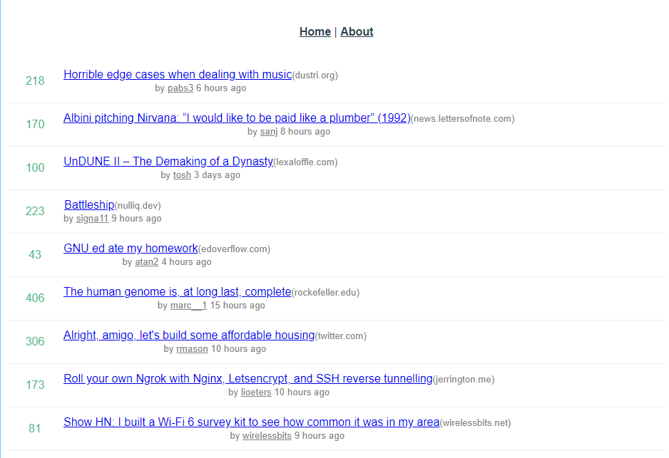

# 실 서비스에 타입스크립트를 적용하는 방법 2가지

## 프로젝트에 타입스크립트 플러그인 추가

바로 typescript를 setup해보자.

```shell
vue add typescript
```

vue-cli 3버전 이상 부터는 구성이 plugin들의 집합으로 구성되어있기 때문에 위 명령어로 추가 할 수 있다.

**하지만 문제점이있다.**

* still proceed : Y
*  Use class-style component syntax? : N
* Use Babel alongside TypeScript? : Y
* Convert all .js files to .ts? N
* Allow .js files to be compiled? : Y
* Skip type checking of all declaration files? : Y

위 처럼 처음 프로젝트를 생성할 때 와는 다른 문구들이 나오기 때문에 주의해야함.

> **Convert all .js files to .ts?** 
>
> 기본적으로 자바스크립트에서 타입스크립트로 바꾸면서 오류가 많이 발생함.
>
> 타입스크립트는 타입이 추가된 언어이기 때문에 타입이 추가된부분에 대해 전부다 에러가 발생하거나 JS의 실행 시점에 타입이 바뀌는 유연한부분들이 다 에러가 나기 시작할 것이다.
>
> 즉, 바로 바꿔버리면 점진적인 적용이 불가능해진다.


```shell
WARNING: You are currently running a version of TypeScript which is not officially supported by typescript-estree.
```

npm run serve 시 우리가 구성한 프로젝트의 일부와 맞지 않다는 경고가뜸.

내부적인 eslint의 버전과 맞지않아서 발생.

```shell
You may find that it works just fine, or you may not.

SUPPORTED TYPESCRIPT VERSIONS: ~3.1.1

YOUR TYPESCRIPT VERSION: 4.1.6

Please only submit bug reports when using the officially supported version.
```

typescript버전이 3.1.1까지만 지원이 되는데 지금 4.1.6을 쓰고있어서 나온 것이다.

1차적으로 버전 충돌 문제 발생.



css 일부가 깨지는 것도 볼 수 있다. App.vue에 가보면 자기마음대로 바꾼걸 볼 수 있다.

```vue
// App.vue
...
<style>
#app {
  font-family: 'Avenir', Helvetica, Arial, sans-serif;
  -webkit-font-smoothing: antialiased;
  -moz-osx-font-smoothing: grayscale;
  text-align: center;
  color: #2c3e50;
}
#nav {
  padding: 30px;
}

#nav a {
  font-weight: bold;
  color: #2c3e50;
}

#nav a.router-link-exact-active {
  color: #42b983;
}
</style>
```

정리 : 마음대로 덮어씌워진 파일들의 복구 문제와 버전수정에 따른 호환성 문제가 해결되기 힘들다.


## 프로젝트 구성 및 실행 결과 확인

변경사항들을 되돌려보자.


다시 repo를 들고오자.

```shell
vue create vue-news
```

다 만들어지면 vue-enws로 이동해서 `code .`을 실행하여 해당 워크페이스를 open

그냥 통째로 옮기면 기본 shims파일도 덮어씌워져서 일단 폴더먼저 복사.

각 파일을 복사하고 axios, vuex, vue-router 설치

```shell
npm i axios vuex vue-router
```


## 타입스크립트 프로젝트 진행방식 안내

1. Vue + Typescript 프로젝트 생성
2. 기존 서비스 코드와 라이브러리를 새 프로젝트에 이동
3. 기본적인 빌드 에러 해결
4. 타입스크립트의 헤택을 볼 수 있는 주요 파일들 위주로 .js -> .ts 로 변환하며 적용

> Tip : 타입 체킹 정도는 덜 엄격한 방식에서 점점 엄격한 방식으로 적용하는 것을 추천

