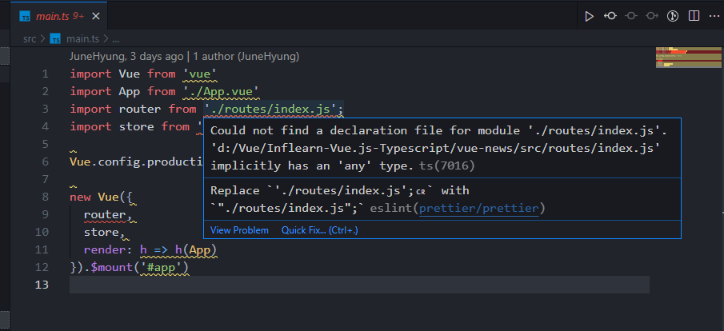

# 09. 점진적인 타입스크립트 적용 방식 1단계

라우터, HOC, 유틸함수


## 프로젝트 빌드 에러 해결

현재 npm run serve를 하게 되면 에러가 발생중.

`npm run build`를 하게 되면 에러가 발생할 것이다.

이 때 우리는 **run serve의 에러와 build상의 에러가 동일**하단걸 볼 수 있다.

하나씩 해결해보자.

### main.ts

main.ts에 발생한 걸 확인하고, 들어가보자.



마지막 라인에 보면 **implicitly has 'any' type** 라고 되있다.

타입이 any라도 붙어 있어야 하는데 그 조차도 없다는 에러다. => strict모드가 적용되어 그럼.

점진적 적용을 위해 strict 레벨을 낮추고 진행.

```json
// tsconfig.json
{
    ...
    "strict": false,
	"noImplicitAny": false,
    "allowJs": true,
}
```

main.ts를 가보면 import쪽에서 나는 에러는 해결된걸 볼 수 있다. => router에는 여전히 에러가발생중이니 router의 index.js로 가보자.

tsconfig.json에서 JS파일을 인식할 수 있게 allowJs도 true로 설정하자.

그 후  run serve와 build가 정상동작하는 것을 확인.

❗ package.json 잘 확인하기. -> 처음에 계속 에러가나서 뭔가했다.


## App.vue에 타입스크립트 적용 및 strict 옵션 참고사항

App.vue에서 부터 new Vue extends형태로 바꿔나가보자.

ts로 script부분만 자동완성.

```typescript
// App.vue
<script lang="ts">
import Vue from 'vue'
export default Vue.extend({
    
})
</script>
```

먼저 import 부분을 가져오고 export default 영역을 채워주자.

```vue
<script lang="ts">
import Vue from "vue";
import ToolBar from "./components/ToolBar.vue";
import Spinner from "./components/Spinner.vue";
import bus from "./utils/bus.js";
export default Vue.extend({
  components: {
    ToolBar,
    Spinner,
  },
  data() {
    return {
      loading: false,
    };
  },
  methods: {
    onProgress() {
      this.loading = true;
    },
    offProgress() {
      this.loading = false;
    },
  },
  created() {
    bus.$on("on:progress", this.onProgress);
    bus.$on("off:progress", this.offProgress);
  },
});
</script>
```

이제 strict 단계를 하나 올려보자. tsconfig 에서 noImplicitAny를 true로 변경.


onProgress의 loading이 any로 나오는데 이는 strict를 true로 주지않았기 때문.

```typescript
this.loading = 1
this.loading = true;
```

이렇게되도 any로 보여짐.

strict를 true로 두게되면 이제 에러가 나기시작.