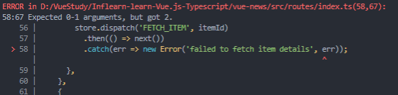

# 10. 점진적인 타입스크립트 적용 방식 1단계

라우터, HOC, 유틸함수


## 프로젝트 빌드 에러 해결

현재 npm run serve를 하게 되면 에러가 발생중.

`npm run build`를 하게 되면 에러가 발생할 것이다.

이 때 우리는 **run serve의 에러와 build상의 에러가 동일**하단걸 볼 수 있다.

하나씩 해결해보자.

### main.ts

main.ts에 발생한 걸 확인하고, 들어가보자.


마지막 라인에 보면 **implicitly has 'any' type** 라고 되있다.

타입이 any라도 붙어 있어야 하는데 그 조차도 없다는 에러다. => strict모드가 적용되어 그럼.

점진적 적용을 위해 strict 레벨을 낮추고 진행.

```json
// tsconfig.json
{
    ...
    "strict": false,
	"noImplicitAny": false,
    "allowJs": true,
}
```

main.ts를 가보면 import쪽에서 나는 에러는 해결된걸 볼 수 있다. => router에는 여전히 에러가발생중이니 router의 index.js로 가보자.

tsconfig.json에서 JS파일을 인식할 수 있게 allowJs도 true로 설정하자.

그 후  run serve와 build가 정상동작하는 것을 확인.

❗ package.json 잘 확인하기. -> 처음에 계속 에러가나서 뭔가했다.


## App.vue에 타입스크립트 적용 및 strict 옵션 참고사항

App.vue에서 부터 new Vue extends형태로 바꿔나가보자.

ts로 script부분만 자동완성.

```typescript
// App.vue
<script lang="ts">
import Vue from 'vue'
export default Vue.extend({
    
})
</script>
```

먼저 import 부분을 가져오고 export default 영역을 채워주자.

```vue
<script lang="ts">
import Vue from "vue";
import ToolBar from "./components/ToolBar.vue";
import Spinner from "./components/Spinner.vue";
import bus from "./utils/bus.js";
export default Vue.extend({
  components: {
    ToolBar,
    Spinner,
  },
  data() {
    return {
      loading: false,
    };
  },
  methods: {
    onProgress() {
      this.loading = true;
    },
    offProgress() {
      this.loading = false;
    },
  },
  created() {
    bus.$on("on:progress", this.onProgress);
    bus.$on("off:progress", this.offProgress);
  },
});
</script>
```

이제 strict 단계를 하나 올려보자. tsconfig 에서 noImplicitAny를 true로 변경.


onProgress의 loading이 any로 나오는데 이는 strict를 true로 주지않았기 때문.

```typescript
this.loading = 1
this.loading = true;
```

이렇게되도 any로 보여짐.

strict를 true로 두게되면 이제 에러가 나기시작.


## 유틸성 파일에 TS 적용 및 주요 TS 적용 포인트 안내

webpack의 entry포인트 처럼 App.vue기준으로 임포트한 곳들을 하나씩 바꿔나가도 된다.

ts를 썻을때 더 빛을 발하는 부분부터 수정해나가보자.

Toolbar나 Spinner는 부수적인거기 때문에 뒤로 미루자.

JS파일도 지금은 allowJS를 사용했지만, 점진적으로 TS로 바꿔나가는 것이 좋다.

bus.js를 bus.ts로 바꾸자.


이제 주요 포인트로 넘어가보자.

### components의 ListItem

```vue
// ListItem.vue
listItems() {
	return this.$store.getters.fetchedList;
}

// getters.js
fetchedList(state) {
	return state.list;
},
```

fetchedList는 action을 호출해서 mutation을 통해 state에 담아줄 것이다.

action이 어디서 호출되는지 router.js에서 보자

```javascript
import Vue from 'vue';
import VueRouter from 'vue-router';
import { ItemView, UserView } from '../views';
import createListView from '../views/CreateListView';
import bus from '../utils/bus.js';
import store from '../store/index.js';

Vue.use(VueRouter);

export default new VueRouter({
  mode: 'history',
  routes: [
    {
      path: '/',
      redirect: '/news' 
    },
    {
      path: '/news',
      name: 'news',
      component: createListView('NewsView'),
      beforeEnter(routeTo, routeFrom, next) {
        bus.$emit('on:progress');
        store.dispatch('FETCH_LIST', routeTo.name)
          .then(() => next())
          .catch((() => new Error('failed to fetch news items')));
      },
    },
   ...
    }
  ]
})
```

store dispatch하면서 바꿔주고있다.

이 파일을 ts로 바꿔보자


## 라우터 파일에 TS 적용 및 라이브러리 내부 타입 선언 파일 설명

먼저, 아까 bus.ts로 바꾼것으로 인해 router의 index.js에서 bus.js부분이 에러발생하니 수정해주자

(일괄 변경 이용)

그 후 router에 index.js를 index.ts로 변경

에러를 살펴보자



new Error가 하나의 인자만 받아야하는데 2가지를 보내서 뒤의 err가 에러가 발생. => err 제거.


```typescript
{
      path: '/news',
      name: 'news',
      component: createListView('NewsView'),
      beforeEnter(routeTo, routeFrom, next) {
        bus.$emit('on:progress');
        store.dispatch('FETCH_LIST', routeTo.name)
          .then(() => next())
          .catch((() => new Error('failed to fetch news items')));
      },
    },
```

beforeEnter에 마우스를 오려보면 타입이 나온다. routeTo에 Route타입을 입력하면 moudles안의 Route가 자동으로 나온다.<br/>(해당 Route는 index.d.ts에서 선언된 Route , alt + 클릭으로 해당 요소를 볼 수 있다.)

나머지도 타입을 채워주자.

```vue
beforeEnter(routeTo:Route, routeFrom: Route, next: NavigationGuardNext<Vue>) {
        bus.$emit('on:progress');
        store.dispatch('FETCH_LIST', routeTo.name)
          .then(() => next())
          .catch((() => new Error('failed to fetch news items')));
      },
```


## HOC 파일에 TS 적용 및 라우터 로직 개선

최신문법을 사용해주는게 ts의 지원을 잘 받을 수 있다.

async await를 사용하자

```typescript
async beforeEnter(routeTo:Route, routeFrom: Route, next: NavigationGuardNext<Vue>) {
        bus.$emit('on:progress');
        try {
          await store.dispatch('FETCH_LIST', routeTo.name);
          next();
        } catch (error) { 
          new Error('failed to fetch news items');
          // next('/error');
        }
      },
```

항상 성공한다는 보장이 없기 때문에 실패했을 때의 처리를 잘 해주는것이 중요하다


### CreateListView

컴포넌트 이름을 부여해주는 기능.

해당 파일을 ts로 바꾸면 에러가나는데 name의 타입이 없기 때문이다.

render함수의 경우 화면에 dom을 그려주는 함수이다. h에 createElement까지 치게되면, vue에 이미 정의되어있다.

그 후 index.ts에 충돌은 없는지 확인하면 된다.

```typescript
import ListView from './ListView.vue';
import bus from '../utils/bus';
import { CreateElement } from 'vue';

export default function createListView(name: string) {
  return {
    name,
    mounted() {
      bus.$emit('off:progress');
    },
    render(h: CreateElement) {
      return h(ListView);
    },
  };
}
```


