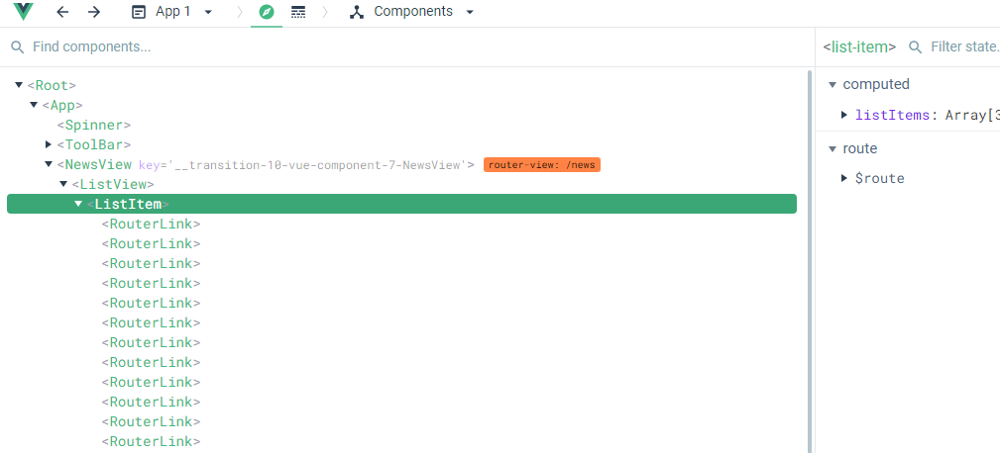
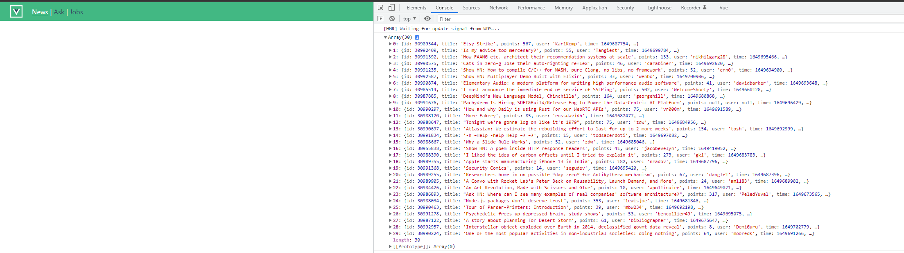
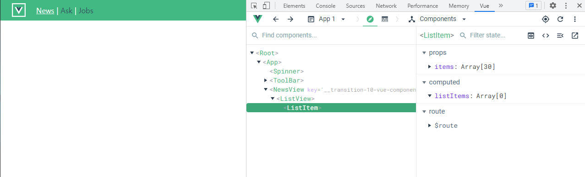

# 점진적인 타입스크립트 적용 방식 2단계 - 컴포넌트, API 함수

## 스토어 상태 관리에 대한 주의 사항 안내

strict 레벨을 조금 올려서 진행.

현재 :

```json
"strict": false,

"noImplicitAny": true,
```

변경

```json
"strict": true,

"noImplicitAny": true,
```


Typescript의 강점 중 하나가 API 호출하고, 데이터의 스펙을 정의하는 구간이다.

Component구조를 보면, 아래와 같다.



Page들어가기전에 데이터를 준비하고 싶다면 지금 구조가 맞지만, Store를 쓰지않아도 되는 상황에도 쓰는 경우가 많다.

데이터를 불러와서 하위컴포넌트에 한번만 뿌려주면되는 경우. 이런경우는 굳이 Store로 들고올 필요없다.

다시 한번 Store가 필요한지 생각해보자.


## API 파일에 타입스크립트 적용 및 호출 로직 구현

api폴더의 index.js -> index.ts로 변경.

그러면 에러가 발생하는데 기본적인 타입정의가 되지않아 그렇다. 우선 any적용.

ListView에서 index.ts에서 fetchNews를 가져와보자.

❗ api를 호출하는 메서드가 있을떄 둘중 하나를 구체적으로작성하여 구분을 두자.

```vue
// ListView.vue
...
<script>
import { fetchNews } from '@/api';
import ListItem from '../components/ListItem.vue';

export default {
  components: {
    ListItem
  },
  methods:{
    async fetchNewsItems(){
      const response = await fetchNews();
      console.log(response.data);
    }
  },

  created(){
    fetchNewsItems();
  }
}
</script>
...
```

자동완성을 이용하면서 작성해보기.

router를 보면 news페이지 들어갈 때 페이지를 들고오고있는데, 잠시 주석처리해두자

```typescript
// router/index.ts
...
{
      path: '/news',
      name: 'news',
      component: createListView('NewsView'),
      async beforeEnter(routeTo:Route, routeFrom: Route, next: NavigationGuardNext<Vue>) {
          bus.$emit('on:progress');
          // try {
          //   await store.dispatch('FETCH_LIST', routeTo.name);
          //   next();
          // } catch (error) { 
          //   new Error('failed to fetch news items');
          //   next('/error');
          // }
          next();
      },
},
...
```

결과를 잘 들고온것을 확인할 수 있다.




## 하위 컴포넌트에 데이터 연결 및 표시 기능 구현

받아온 데이터를 하위에 넘겨보자

기존에 정의된 list-item 컴포넌트를 파스칼케이스로 바꾸자. 그리고, props를 넘기자.

```vue
// ListView
<template>
  <div>
    <ListItem :items="newsItems"></ListItem>
  </div>
</template>

<script>
import { fetchNews } from '@/api'
import ListItem from '../components/ListItem.vue'

export default {
  components: {
    ListItem
  },
  data() {
    return {
      newsItems: []
    }
  },
  methods: {
    async fetchNewsItems() {
      const response = await fetchNews()
      console.log(response.data)
      this.newsItems = response.data
    }
  },

  created() {
    this.fetchNewsItems()
  }
}
</script>
```

```vue
// ListItem.vue
...
<script>
export default {
  props: {
    items: {
      type: Array,
      required: true
    }
  },
...
```



기존엔 computed로 store에서 받았지만, 이제는 props로 받기 때문에 props로 받는 걸로 수정하면 리스트가 잘 나올것이다.

```vue
<template>
  <ul class="news-list">
    <li v-for="news in items" :key="news.id" class="post">
      <div class="points">
        {{ news.points || 0 }}
          ...
```

