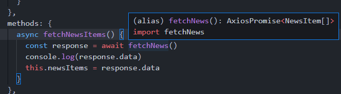
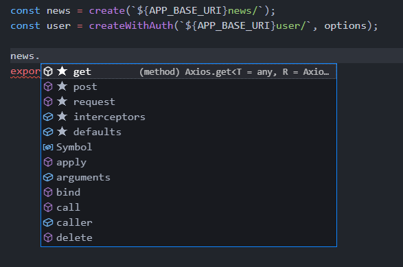

# 점진적인 타입스크립트 적용 방식 2단계 - 컴포넌트, API 함수

## 스토어 상태 관리에 대한 주의 사항 안내

strict 레벨을 조금 올려서 진행.

현재 :

```json
"strict": false,

"noImplicitAny": true,
```

변경

```json
"strict": true,

"noImplicitAny": true,
```


Typescript의 강점 중 하나가 API 호출하고, 데이터의 스펙을 정의하는 구간이다.

Component구조를 보면, 아래와 같다.


Page들어가기전에 데이터를 준비하고 싶다면 지금 구조가 맞지만, Store를 쓰지않아도 되는 상황에도 쓰는 경우가 많다.

데이터를 불러와서 하위컴포넌트에 한번만 뿌려주면되는 경우. 이런경우는 굳이 Store로 들고올 필요없다.

다시 한번 Store가 필요한지 생각해보자.


## API 파일에 타입스크립트 적용 및 호출 로직 구현

api폴더의 index.js -> index.ts로 변경.

그러면 에러가 발생하는데 기본적인 타입정의가 되지않아 그렇다. 우선 any적용.

ListView에서 index.ts에서 fetchNews를 가져와보자.

❗ api를 호출하는 메서드가 있을떄 둘중 하나를 구체적으로작성하여 구분을 두자.

```vue
// ListView.vue
...
<script>
import { fetchNews } from '@/api';
import ListItem from '../components/ListItem.vue';

export default {
  components: {
    ListItem
  },
  methods:{
    async fetchNewsItems(){
      const response = await fetchNews();
      console.log(response.data);
    }
  },

  created(){
    fetchNewsItems();
  }
}
</script>
...
```

자동완성을 이용하면서 작성해보기.

router를 보면 news페이지 들어갈 때 페이지를 들고오고있는데, 잠시 주석처리해두자

```typescript
// router/index.ts
...
{
      path: '/news',
      name: 'news',
      component: createListView('NewsView'),
      async beforeEnter(routeTo:Route, routeFrom: Route, next: NavigationGuardNext<Vue>) {
          bus.$emit('on:progress');
          // try {
          //   await store.dispatch('FETCH_LIST', routeTo.name);
          //   next();
          // } catch (error) { 
          //   new Error('failed to fetch news items');
          //   next('/error');
          // }
          next();
      },
},
...
```

결과를 잘 들고온것을 확인할 수 있다.


## 하위 컴포넌트에 데이터 연결 및 표시 기능 구현

받아온 데이터를 하위에 넘겨보자

기존에 정의된 list-item 컴포넌트를 파스칼케이스로 바꾸자. 그리고, props를 넘기자.

```vue
// ListView
<template>
  <div>
    <ListItem :items="newsItems"></ListItem>
  </div>
</template>

<script>
import { fetchNews } from '@/api'
import ListItem from '../components/ListItem.vue'

export default {
  components: {
    ListItem
  },
  data() {
    return {
      newsItems: []
    }
  },
  methods: {
    async fetchNewsItems() {
      const response = await fetchNews()
      console.log(response.data)
      this.newsItems = response.data
    }
  },

  created() {
    this.fetchNewsItems()
  }
}
</script>
```

```vue
// ListItem.vue
...
<script>
export default {
  props: {
    items: {
      type: Array,
      required: true
    }
  },
...
```


기존엔 computed로 store에서 받았지만, 이제는 props로 받기 때문에 props로 받는 걸로 수정하면 리스트가 잘 나올것이다.

```vue
<template>
  <ul class="news-list">
    <li v-for="news in items" :key="news.id" class="post">
      <div class="points">
        {{ news.points || 0 }}
          ...
```


## API 함수 타입 정의

우리가 fetchNews를 사용하는데 api폴더의 index.ts를 보면 fetchNews의 반환타입이 정해져있지 않다.

Response타입을보면 AxiosResponse에 제네릭타입으로 any가있다.

`const response: AxiosResponse<any>`

추론되는 타입이 response에 나오기때문에 fetchNews의 반환타입을 정해주어야 한다.


이전강의에서는 AxiosResponse를 썻지만 실무에서는 **AxiosPromise**를 주로 사용한다.<br/>
(AxiosPromise를 사용하면 Generic을 좀더 줄일 수 있다.)

Preview에서 타입을 그대로 가져와 타입을 선언해주자.

```json
interface NewsItem {
  comments_count: number
  domain: string
  id: number
  points: number
  time: number
  time_ago: string
  title: string
  type: string
  url: string
  user: string
}
```

그 후 fetchNews가 NewsItem을 가지는 배열인것을 알 수 있다.

```typescript
function fetchNews(): AxiosPromise<NewsItem[]> {
  return axios.get(api.news)
}
```

위처럼 타입선언을 해주면 아래 사진처럼 추론 되는 것을 볼 수 있다.



추론이 되기 때문에 response.data. 이나 response.data[0]. 을하게되면 그 안의 속성이나 api를 사용할 수 있는걸 확인할 수 있다.


참고 

[Generic 소개 문서](https://joshua1988.github.io/ts/guide/generics.html)


## 프롭스 속성 타입 정의

ListView.vue를 보면 newsItems란 아이템을 props로 내리고있다.

ListItem에다 items의 타입이뭔지 정의해야한다.

```vue
 props: {
    items: {
      type: Array,
      required: true
    }
  },
```

as PropType으로 하게되면 처음 보는형태가 보이게될거다.

```vue
props: {
    items: {
      type: Array as import('vue').PropType,
      required: true
    }
  },
```

이는 script가 typescript가 아니라서 발생한 것이다.


script를 ts로바꿔준 후 다시보면 getters에 에러가나는데 타입 정의가 되있지 않아 그렇다.

❗ 첫번쨰 프로젝트때 computed에 반환타입을 반드시 적어야한다고 했었다.


```vue
<template>
...
</template>
<script lang="ts">
import Vue, { PropType } from 'vue'
export default Vue.extend({
  props: {
    items: {
      type: Array as PropType<NewsItem[]>,
      required: true
    }
  },
  computed: {
    listItems(): any {
      return this.$store.getters.fetchedList
    }
  }
})
</script>
...
```

PropType을 처음 작성하면 NewsItem에서 에러가 날텐데 이는 index.ts에서 export를 안했기 때문.

export를 해주고 import를 다시 해주면 에러가 사라진다.


## 프롭스 속성타입 정의의 이점과 computed 속성 활용 방법 안내

예를 들어, 지금 시간이 찍히는것 뒤에 년도값을 받아 붙인다고 가정해보자.

아래 같은 형태가 될 것이다.

```vue
<small v-if="news.time_ago" class="link-text">
    {{ news.time_ago.concat('', 2021) }}
</small>
```

이는 time_ago가 string인걸 알고 바로 concat을 붙인건데, 이는 api를 알고있기 때문에 사용할 수 있다.

만약 concet이란 오타가 난다면, 코드에서가 아니라 화면에서 에러를 확인할 수 있다.


```vue
timeAgo(): string{
	return this.items[0].time_ago.
}
```

이런 메서드를 입력하면, time_ago에서 .을찍었을때 string api 메서드가 나온다.

concat을 선택하면 concat의 스펙들을 확인할 수도있다.

❗ 여기서 타입스크립트의 장점을 중 하나인 안정적인 코딩이 가능하다.

```vue
<template>
<small v-if="news.time_ago" class="link-text">
          <!-- {{ news.time_ago }} -->
          {{ timeAgo(news) }}
        </small>
</template>
<script>
methods: {
    timeAgo(news: NewsItem): string {
      return news.time_ago.concat(',2021')
    }
  },
  </script>
```

이처럼 기본 제공하는 api를 작성시 중간과정에서의 이점을 확인할 수 있다.


## axios 타입 정의 마무리

마지막으로 ListView의 script를 타입스크립트로 변경해보자.

이전처럼 ts로 자동완성하여 Vue.extend형태로 만들어 옮기자

```vue
<template>
...
</template>
<script lang="ts">
import Vue from 'vue'
import { fetchNews } from '@/api'
import ListItem from '../components/ListItem.vue'
export default Vue.extend({
  components: {
    ListItem
  },
  data() {
    return {
      newsItems: []
    }
  },
  methods: {
    async fetchNewsItems() {
      const response = await fetchNews()
      // console.log(response.data)
      this.newsItems = response.data
    }
  },

  created() {
    this.fetchNewsItems()
  }
})
</script>

```

지금 newsItems의 형태고 never[]라 빨간줄이 생겨있다.

response.data는 NewsItem[]으로 정의되있다.

data쪽에 타입을 써주자.

```vue
...
data() {
    return {
      newsItems: [] as NewsItem[]
    }
  },
...
```


그 다음 index-instance.js 를 ts로 변경하자.

url들의 타입을 string으로 선언.  (어느 서버로 접속할 건지에 대한 url이다.)

각 메소드에 마우스를 올리면 AxiosInstance라고 추론이 잘되는 걸 볼 수 있다.

```vue
<script>
function create(url: string, options = {}) {
  const instance = axios.create(Object.assign({ baseURL: url }, options));
  return instance;
}

function createWithAuth(url: string, options = {}) {
  const instance = axios.create(Object.assign({ baseURL: url }, options));
  setRequestOptions(instance);
  setResponseOptions(instance);
  return instance;
}
</script>
```

그렇기 때문에 news를 이용해 무언가 작성하려 하면, 사진처럼 각 메서드가 나오는 걸 볼 수 있다.




```vue
function create(url: string, options = {}): string {
  const instance = axios.create(Object.assign({ baseURL: url }, options));
  return instance;
}
```

위 처럼 잘못된 타입을 쓰게되면 return에서 잘못된 타입을 반환한다고 에러가 발생한다.
