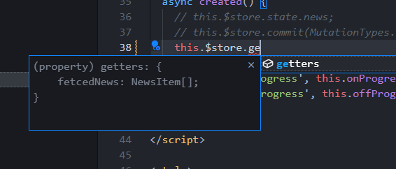

# 12. 점진적인 타입스크립트 적용 방식 3단계 - Vuex 스토어 타입 정의

## 스토어 TS 파일 변환 및 컴포넌트의 타입 추론 문제 소개

```typescript
import Vue from 'vue'
import App from './App.vue'
import router from './routes/index';
import store from './store/index.js';

Vue.config.productionTip = false

new Vue({
  router,
  store,
  render: h => h(App)
}).$mount('#app')

```

여기서 여태까지 router의 타입정의까지 살펴보았고, 이제 store쪽을 살펴보자.

store의 index.js -> ts로 변환.

들어가기전에❗ store에서는 타입시스템에 대한 이해가 좀 더 필요하다.<br/>ts로 바꿧을때 에러가 발생하지 않지만, 가져다 쓸때 어떤문제가 생기는지 살펴보자.

App.vue created에서 store에 접근해보자.

```vue
<template>
...
</template>
<script lang="ts">
    ...
    create(){
        this.$store.state.
    }
...
</script>
```

state까지는 추론을 통해 찾을 수 있지만, 그 뒤로는 추론이 되지않는 것을 볼 수 있다.

```vue
// store/index.ts
...
export default new Vuex.Store({
  strict: process.env.NODE_ENV !== 'production',
  state: {
    news: [],
    ask: [],
    jobs: [],
    user: {},
    item: {},
    list: []
  },
  getters,
  mutations,
  actions
});
```

이처럼 state가 정의 되있지만, 추론이 되지않아 자바스크립트처럼 사용해야하는 경우가 발생한다.


## 스토어의 타입 추론이 안되는 이유 분석

$store를 타고 들어가게 되면 vue.d.ts파일로 가게 된다.

```vue
declare module "vue/types/options" {
  interface ComponentOptions<V extends Vue> {
    store?: Store<any>;
  }
}
      
declare module "vue/types/vue" {
  interface Vue {
    $store: Store<any>;
  }
}
```

this.$store의 타입추론을 보게되면, Vue라고 정의되있는 타입안에서 $store를 확장했다고 보면된다.

Vue내부적으로 여러 속성들의 기본적인 타입을 정의 해놓았다.

interface merging이라고 해서 두번 인터페이스를 쓰게되면 두개의 인터페이스가 합쳐진다.

이거를 declaration merging(선언 병합) 이라고한다.

참고 : [타입스크립트 선언 병합(declaration mergin)](https://www.typescriptlang.org/docs/handbook/declaration-merging.html)


Store를 쫒아 들어가보자.

this.$store는 `Store<any>`로 추론이 되고있다. 저말은 any가 제네릭으로 들어간다는 것이고,

Store를 보면 아래의 S라는 타입에 any가 들어가 관련 된 모든 속성들이 any로 추론되는 것이다.

```vue
export declare class Store<S> {
  constructor(options: StoreOptions<S>);

  readonly state: S;
  readonly getters: any;

  replaceState(state: S): void;

  dispatch: Dispatch;
  commit: Commit;

  subscribe<P extends MutationPayload>(fn: (mutation: P, state: S) => any, options?: SubscribeOptions): () => void;
....
```

그렇기 때문에 state에 any가 들어가 news등 추론이 되지않는다.


## Vuex 타입 정의 방법 안내 - state

**❗❗❗ [필독! 뷰엑스 타입 정의 방법](https://joshua1988.github.io/vue-camp/ts/vuex.html)**

**❗ 정말 간단하게만 들고온 것이니 참고 링크에서 자세히 확인하기.**

**간단하게 state, mutations, actions, getters만 먼저 들고온 것이니 처음부터 끝까지 다읽어보기**


`Vue.extend()`방식을 이용해 뷰엑스를 타이핑 하려면 뷰엑스 라이브러리 내부적으로 제공하는 타입을 약간 변형해주어야함.

### Vuex 기본코드

```typescript
// store/index.ts
import Vue from "vue";
import Vuex from "vuex";

Vue.use(Vuex);

const store = {
  state: {
    token: ''
  }
};

export default new Vuex.Store(store);
```


### state정의

```typescript
// store/state.ts
export const state = {
  token: '',
}

export type RootState = typeof state;
```

분리를 따로 안해도되지만 분리하는 것을 추천.

index.ts하나에 다 작성해버리면, 관리가 힘들어지기 때문에 모듈화 추천.

 state.ts에서 선언한 state라는 타입을 RootState라는 타입변수로 선언해주었다.


### mutation 정의

```vue
// store/mutations.ts
import { RootState } from "./state";

// 뮤테이션 타입
export enum MutationTypes {
  SET_TOKEN = "SET_TOKEN",
}

// 뮤테이션 속성 함수
export const mutations = {
  [MutationTypes.SET_TOKEN](state: RootState, token: string) {
    state.token = token;
  },
};

export type Mutations = typeof mutations;
```

뮤테이션 속성 함수의 타입 추론을 위해 뮤테이션 함수의 이름은 모두 enum값으로 선언하고,<br/> 해당 값을 함수의 이름으로 정의 해줌.

state에서 선언한 RootState를 들고와 뮤테이션 속성함수의 첫번째 파라미터 타입으로 연결 해주었다.

**❗ 정말 간단하게만 들고온 것이니 참고 링크에서 자세히 확인하기.**

**참고 : [Cracking Vue.js Vuex 타입 정의 문서](https://joshua1988.github.io/vue-camp/ts/vuex.html)**


### actions 정의

```typescript
// store/actions.ts
import { ActionContext } from "vuex";
import { Mutations } from "./mutations";
import { RootState } from "./state";

export enum ActionTypes {
  FETCH_NEWS = "FETCH_NEWS"
}

interface News {
  title: string;
  id: number;
}

type MyActionContext = {
  commit<K extends keyof Mutations>(
    key: K,
    payload?: Parameters<Mutations[K]>[1]
  ): ReturnType<Mutations[K]>;
} & Omit<ActionContext<RootState, RootState>, "commit">;

export const actions = {
  async [ActionTypes.FETCH_NEWS](context: MyActionContext, payload?: number) {
    const res = await fetch("https://jsonplaceholder.typicode.com/users/1");
    const user: News[] = await res.json();
    return user;
  }
};

export type Actions = typeof actions;
```


### getters 정의

```typescript
// store/getters.ts
import { RootState } from "./state";

export const getters = {
  getToken(state: RootState) {
    return state.token + "!";
  }
};

export type Getters = typeof getters;
 
```


## state 타입 정의

state를 먼저 정의 -> 컴포넌트에 추론이 되는지 확인 -> mutation추가 -> 확인 ... 방식으로 진행

```vue
import Vue from 'vue';
import Vuex from 'vuex';
import getters from './getters.js';
import mutations from './mutations.js';
import actions from './actions.js';

Vue.use(Vuex);

const store = {
  state: state,
}

export default new Vuex.Store(store);
```

기존 코드를 주석처리하고 새로 작성.<br/>새로 작성하는 store가 우리가 추가할 옵션들이다.

store에 선언된 state를 가져오기위해 state.ts를 생성

기존의 newsItem[]을 구현해보자.

```typescript
// state.ts
import { NewsItem } from "@/api";

const state = {
  news: [] as NewsItem[],
}
type RootState = typeof state;
export {state, RootState }
```

state의 news는 NewsItem을 배열로 가지는 배열.

RootState를 선언해주게 되면 RootState의 타입이 state의 형태로 잡히는 걸 볼 수 있다.


마지막으로 state도 index.ts에서 들고와 사용할 것이기 때문에 export 시켜준다. 


```typescript
// index.ts
...
import {state} from './state';
...
```

index.ts에서 import해 사용 시 `import state from './state';` 이렇게 사용하면 에러가 날것이다.

> Module '"d:/VueStudy/Inflearn-learn-Vue.js-Typescript/vue-news/src/store/state"' has no default export. Did you mean to use 'import { state } from "d:/VueStudy/Inflearn-learn-Vue.js-Typescript/vue-news/src/store/state"' instead?

state.ts에서 default로 export하지 않았는데 default로 export한 것처럼 import했다는 에러.


## 스토어 내부 타입에 state타입 연결

App.vue에서 다시 사용해보면, 아직 연결이 되어있지않다.

컴포넌트에서도 추론될 수 있도록 수정해보자.

### store의 any를 RootState로 변경

node_moduels에 vuex의 vue.d.ts를 보면, $sotre의 타입이 Store<any> 로 되어있는데. 이 any를 RootState로 바꾸면 된다.

변경후 편집기를 재시작하면 타입추론이 되는 것을 볼 수 있다.

```typescript
/**
 * Extends interfaces in Vue.js
 */
import { RootState } from "@/store/state";
import Vue, { ComponentOptions } from "vue";
import { Store } from "./index";

declare module "vue/types/options" {
  interface ComponentOptions<V extends Vue> {
    store?: Store<RootState>;
  }
}

declare module "vue/types/vue" {
  interface Vue {
    $store: Store<RootState>;
  }
}
```

❗  ( node_modules를 다른사람들과 공유할 때 문제가 있다고 생각해서 커뮤니티를 찾아봤는데 추후 강의에 문제점이나 해결방법 등 관련 설명이 나온다고 하니 참고)

[Community-about-nodemoudles](https://www.inflearn.com/questions/220459)


## Mutations 타입 정의

store와 동일하게 mutaions.ts로 모듈화를 할 것. 

먼저 index.ts파일에 추가.

```typescript
import Vue from 'vue';
import Vuex, { StoreOptions } from 'vuex';
import {RootState, state} from './state'
// import getters from './getters.js';
// import mutations from './mutations.js';
// import actions from './actions.js';

Vue.use(Vuex);

const store: StoreOptions<RootState> = {
  state: state,
  mutations: mutations
}

export default new Vuex.Store(store);
```

> ❗  **TIP**
>
> typescript를 사용하다보면, mutations를 추가로 작성할 때 mu까지만 쳐도 자동완성 되는 것을 원할 수 있다.
>
> 그때 store에 StoreOptions를 추가하면, mu만쳤을때 mutation이 자동완성 되게 할 수 있다.

기존의 mutations.js를 ts로 변경하고, 기존의 코드를 전부 주석처리.

**mutations함수의 이름들을 전부 enum으로 관리할 것이다.**

```typescript
enum MutationTypes { 
  SET_NEWS = "SET_NEWS"
}
```

MutationTpyes.SET_NEWS를 했을 때 SET_NEWS가 String값으로 들어가게 설정.

SET_NEWS의 state는 RootState로, news는 newsItem의 배열로 정의.

```typescript
import { NewsItem } from "@/api";
import { RootState } from "./state";

enum MutationTypes { 
  SET_NEWS = "SET_NEWS"
}

const mutations = {
  [MutationTypes.SET_NEWS](state:RootState, news:NewsItem[]) {
    state.news = news;
  },
}

export { mutations };
```

**❗ 자동완성을 적극 활용하자.**


마지막으로 mutations에 정의된 내용이 타입으로 정의해야 추론할 수 있다.

```typescript
type Mutations = typeof mutations;
```


>  **❗ 주의할점**
>
> Mutations의 s가 빠지게되면 vuex내부에 정의된 mutation타입이 된다.
>
> 햇갈린다면 Mutations 이름을 custom해서 사용.


## 스토어 타입 추론을 위한 타입 파일 작성

mutation타입이 잘 추론되게 중간에 코드를 추가해보자.

store의 타입추론을 시켜주는 코드는 어떻게 작성하는지 문서를 보며 알아보자.

**참고 : [뷰 컴포넌트에서 활용할 수 있도록 뷰엑스 커스텀 타입 정의](https://joshua1988.github.io/vue-camp/ts/vuex.html#뷰-컴포넌트에서-활용할-수-있도록-뷰엑스-커스텀-타입-정의)**

```typescript
// store/types.ts
import { CommitOptions, Store } from "vuex";
import { Mutations } from "./mutations";
import { RootState } from "./state";

type MyMutations = {
  commit<K extends keyof Mutations, P extends Parameters<Mutations[K]>[1]>(
    key: K,
    payload?: P,
    options?: CommitOptions
  ): ReturnType<Mutations[K]>;
};

export type MyStore = Omit<Store<RootState>, "commit"> & MyMutations
```

스토어에 types라는 파일을 만들어 내부코드를 작성해 주어야 한다.<br/>(참고에 있는 코드들을 가져옴)

아무리 vuex에 타입파일을 추론시키게 변경해도 다른 commit이나 dispatch등의 자동완성이나 자동추론이 되게하는 것은 어렵다.


## 스토어 타입 파일 설명 및 스토어 내부 타입 확장

위 코드에 대해 하나씩 알아가보자.

우선 type MyMutations보다는 export쪽을 보자.

```typescript
export type MyStore = Omit<Store<RootState>, "commit"> & MyMutations
```

types.ts에서 내보내는 타입은 MyStore라는 타입이다.

**MyStore는 Omit과 MyMutations의 합집합(&)**

```typescript
// 인터섹션(합집합) 예제
type A = {
	name: string;
}
type B = {
	age: number;
}
type C = A & B;
const person:C ={
	name: 'a',
	age: 10;
}
```


### Omit

(이전 강의 고급타입에서 한번 봤었다.)

특정 타입에서 지정된 속성만 제거한 타입을 정의해줌.

```typescript
const person = {
    name: 'a',
    age: 10,
    skill: 'js',
}
const jo = Omit<person, 'skill'>
// jo = { name: 'a', age: 10}
```


다시 원래 코드를 살펴보자.

```typescript
export type MyStore = Omit<Store<RootState>, "commit"> & MyMutations
```

**`commit만 빼고 전부 들고오겠다.`는 뜻.**

commit을 빼는이유는 commit에 대해서 **프로젝트 레벨에서 재정의** 하는 것이다.

**재정의를 통해 그 부분만 MyMutations로 갈아 끼워 합친다는 뜻**이다.


vue.d.ts에서

Store<RootState>부분을 MyStore로 변경.

`@/store/types` 이부분이 node_moduels에서 제약이 걸려 @가 에러가 날 것이다.<br/>동작엔 문제가 없지만 거슬린다면 상대경로로 변경.

`this.$store.commit()`의 타입이 우리가 정의한 타입이 된 걸 볼 수있다.

`this.$store.commit(MutationTypes.SET_NEWS, )`했을 때 뒤의 payload가 타입추론이 정상적으로 동작하는 걸 볼 수 있다. => 10입력 시 newsitem[]이 아니라 에러 발생.

참고 : <br/>[고급타입](https://github.com/JuneHyung/Inflearn-learn-Typescript/blob/main/정리/실전/17. 고급 타입.md)<br/>[타입스크립트 Omit](https://joshua1988.github.io/ts/usage/utility.html#자주-사용되는-유틸리티-타입-몇-개-알아보기)


## 뮤테이션 타입 설명 마무리 및 actions 타입 정의 안내

type MyMutations에 대해 살펴보자.

```typescript
type MyMutations = {
  commit<K extends keyof Mutations, P extends Parameters<Mutations[K]>[1]>(
    key: K,
    payload?: P,
    options?: CommitOptions
  ): ReturnType<Mutations[K]>;
};
```


지난강의에서 MyStore가 기존 Store에서 commit을 뺀 것과 MyMutations에서 정의한 commit을 합친 것을 볼 수 있었다.

commit의 스팩은 기본 Store의 commit스펙에서  Mutations란 타입을 가지고 추론 할 수 있게 끔 추가적으로 작성되었다. 

**Mutations의 키와 Mutations[K]의 두번째 파라미터(payload)**를 받아 연결해주었다.

```typescript
commit(MutationsTypes.SET_NEWS, )
```

위 처럼 작성 했을 때 SET_NEWS에 해당하는 mutations속성함수의 키값에 따라서 두번째 파라미터의 타입이 같이 추론이 되는 형태.


options의 경우 기본 Vuex에서 제공하는 CommitOptions를.

그리고 ReturnType이라는 유틸리티 타입을 이용해 Mutation의 반환타입까지 리턴하는 것을 볼 수 있다.


actions를 살펴보자.

index.ts에 이전과 동일하게 actions를 추가해두고, actions.js -> actions.ts로 변경.

기존의 코드는 주석처리로 해두자.


문서를 보자.

```typescript
// store/actions.ts
import { ActionContext } from "vuex";
import { Mutations } from "./mutations";
import { RootState } from "./state";

export enum ActionTypes {
  FETCH_NEWS = "FETCH_NEWS"
}

interface News {
  title: string;
  id: number;
}

type MyActionContext = {
  commit<K extends keyof Mutations>(
    key: K,
    payload?: Parameters<Mutations[K]>[1]
  ): ReturnType<Mutations[K]>;
} & Omit<ActionContext<RootState, RootState>, "commit">;

export const actions = {
  async [ActionTypes.FETCH_NEWS](context: MyActionContext, payload?: number) {
    const res = await fetch("https://jsonplaceholder.typicode.com/users/1");
    const user: News[] = await res.json();
    return user;
  }
};

export type Actions = typeof actions;
```

vuex의 ActionContext랑 앞에서 정의했던 Mutations와 RootState를 들고온다.

그리고 mutatinos처럼 Actiontypes를 enum으로 정의.

그리고 actinos를 작성하고, 마지막에 export시켜주는 걸 볼 수 있다.

**참고 : [actions 정의](https://joshua1988.github.io/vue-camp/ts/vuex.html#actions-정의)**


## Actions 타입 정의

```typescript
import { fetchNews, NewsItem } from '@/api';
import { ActionContext } from 'vuex';

enum ActionTypes {
  FETCH_NEWS = 'FETCH_NEWS'
}

const actions = {
  [ActionTypes.FETCH_NEWS](context: ActionContextntext, payload?: NewsItem[]){

  }
};
```

ActionContext를 vuex에서 받을건데 이거를 확장을 할거다.

사실 payload가 의미가없다. => `this.$store.dispatch(ActionTypes.FETCH_NEWS)` 이런식으로 호출할 꺼기 때문에 굳이 필요없다.

context에 들어갈 타입을 정의하자.(문서의 타입을 들고오자.)

```typescript
...
type MyActionContext = {
  commit<K extends keyof Mutations>(
    key: K,
    payload?: Parameters<Mutations[K]>[1]
  ): ReturnType<Mutations[K]>;
} & Omit<ActionContext<RootState, RootState>, 'commit'>;

const actions = {
  [ActionTypes.FETCH_NEWS](context: ActionContextntext, payload?: NewsItem[]) {}
};
```

MyActionContext는 Store밑에 types와 비슷하다.

commit을 Omit으로 빼서 custom을 합쳐서 제공. => 우리가 정의한 타입까지 mutations안에서 추론되게끔 정의하겠다는 뜻.

`Omit<ActionContext<..., ''>`에서 **좌측이 모듈화된 state. 우측이 RootState.**

**ActionContext를 들어가서 잘살펴보기.**

```typescript
...
export interface ActionContext<S, R> {
  dispatch: Dispatch;
  commit: Commit;
  state: S;
  getters: any;
  rootState: R;
  rootGetters: any;
}
...
```

위 코드를 보면 좌측의 S가 state, 우측의 R이 rootState인 것을 볼 수 있다.


이제 actions의 내용을 작성해보자

```typescript
const actions = {
  [ActionTypes.FETCH_NEWS](context: MyActionContext, payload?: NewsItem[]) {
    // acttions내용
	return fetchNews();
  }
};
```

fetchNews()를 리턴 시키기위해 타이핑을 하면 api쪽의 fetchNews가 자동완성되는것을 볼 수 있다.

아래 사진처럼 actions가 추론되는 것을 볼 수 있다.


action의 역할은 api의 값을 꺼내서 commit에 담아두는 것.

fetchNews의 결과를 async await로 접근하자.

```typescript
const actions = {
  async [ActionTypes.FETCH_NEWS](context: MyActionContext, payload?: any) {
    // acttions내용
    const response = await fetchNews();
  }
};
```


response가 AxiosResponse<NewsItem[]>으로 추론되는 것을 볼 수 있다.

```typescript
const { data } = await fetchNews();
```

data의 타입은 NewsItem[] 으로 추론되는 것을 확인할 수 있다.

mutation으로 넘겨주자.

(**context부터 끝까지 모두 자동완성으로 작성가능!**)

```typescript
context.commit(MutationTypes.SET_NEWS, data);
```

마지막으로 export 시켜주자.

```typescript
export { ActionTypes, actions, Actions };
```


## 스토어 타입 파일에 actions 타입확장.

컴포넌트레벨에서 추론될 수 있게 types쪽에 추가적인 정의.

먼저 index.ts에 추가 export한 actions를 추가.

```typescript
import Vue from 'vue';
import Vuex, { StoreOptions } from 'vuex';
import { RootState, state } from './state';
import { mutations } from './mutations';
import { actions } from './actions';
// import getters from './getters.js';
// import mutations from './mutations.js';
// import actions from './actions.js';

Vue.use(Vuex);

const store: StoreOptions<RootState> = {
  state: state,
  mutations: mutations,
  actions: actions
};

export default new Vuex.Store(store);
```


types.ts에 추가 정의를 해주자.

```typescript
type MyActions = {
  dispatch<>()
}
export type MyStore = Omit<Store<RootState>, "commit" | "dispatch"> & MyMutations & MyActions
```

컴포넌트레벨에서 작성한 것이 잘 추론될 수 있도록, dispatch를 따로 정의할 것이고,

MyActions를 MyStore에 인터섹션을 이용해 확장.


```typescript
// store/types.ts
import { CommitOptions, DispatchOptions, Store } from 'vuex';
...

type MyActions = {
  dispatch<K extends keyof Actions>(
    key: K,
    payload?: Parameters<Actions[K]>[1],
    options?: DispatchOptions
  ): ReturnType<Actions[K]>;
};

export type MyStore = Omit<Store<RootState>, 'commit' | 'dispatch'> &
  MyMutations &
  MyActions;
```

options의 DispatchOtpions는 vuex내부에 있는 DispatchOptions이다.


컴포넌트 레벨에서 확인해보자.

```typescript
// App.vue
this.$store.dispatch(ActionTypes.FETCH_NEWS);
```

dispatch를 작성할 때 dispatch가 정상적으로 나오는걸 확인할 수 있다.

해당 코드를 작성 시 모두 자동완성이 가능.


```typescript
const response = await this.$store.dispatch(ActionTypes.FETCH_NEWS);
```

response의 타입은 any로나온다. => FETCH_NEWS의 반환타입을 좀더 명시적으로 작성.

```typescript
const actions = {
  async [ActionTypes.FETCH_NEWS](context: MyActionContext, payload?: any) {
    // acttions내용
    // const response = await fetchNews();
    const { data } = await fetchNews();
    context.commit(MutationTypes.SET_NEWS, data);
    return data;
  }
};
```

return data를 해주게되면 아래사진처럼 data의 타입이 추론되는 걸 볼 수있다.


## 커스텀 타입을 프로젝트 레벨로 설정하는 방법

커스텀타입파일을 프로젝트에서 어떻게 관리하면 좋을지 알아보자.

> ❗ ctrl+,에서 exclude를 검색하고 pattern을 추가하여 보고있는 파일을 안보이게 설정 가능.
>
> ex)
>
> **/node_modules
>
> node_modules폴더가 보이지 않음.

vue.d.ts를 보면 주석으로 `Extends interfaces in Vue.js`라고 있을 것이다.

Vue.js 내부적으로 Vue인터페이스가 정의 되있을거고, 그 인터페이스를 확장하는 방식이 정의되있다.

지금 우리가 했던거는 그 node_modules에서 작성했던 파일을 들고와 확장하였다.


### 문제점

(지난번에 RootState를 정의할때 생각했던 문제점)

* 다지우고, 라이브러리를 npm install로 다시 설치하게되면 다 날아감. => 관리가 잘 되지 않는다.
* 코드를 저장하고, 팀단위 개발 시 git으로 형상관리가 되지 않음<br/>보통 gitignore에서 node_modules를 삭제하기때문에 추적이 되지않음.


### 프로젝트 타입 정의 확장하기

vuex밑의 vue.d.ts파일 내용을 프로젝트 바깥으로 꺼내서 tsconfig파일에 설정만 해주면된다.

```typescript
// src/types/project.d.ts
import Vue from "vue";
import { MyStore } from "../store/types";

declare module "vue/types/vue" {
  interface Vue {
    $store: MyStore;
  }
}

declare module "vue/types/options" {
  interface ComponentOptions<V extends Vue> {
    store?: MyStore;
  }
}
```


## 뷰엑스 커스텀 타입을 프로젝트 레벨에 설정

프로젝트레벨에서 잘 설정되도록 tsconfig파일을 수정.

```json
"include": [
    "src/**/*.ts",
    "src/**/*.tsx",
    "src/**/*.vue",
    "tests/**/*.ts",
    "tests/**/*.tsx",
    "src/types/**/*.d.ts"
  ],
```

`src/project.d.ts`로 사용해도되지만 타입들에 대한 정의를 추가해 나갈 예정이기 때문에 types폴더안에 모든폴더에 모든 파일의 d.ts까지 포함

작성한 project.d.ts는 types폴더안으로 이동.


점진적으로 적용하다보니 tscoinfig 첫번째 줄에 에러가 발생하였다. 내부에 js파일이 있다는 에러.

해당주소로가서 파일을 ts로 변경.


`npm run serve`로 버그를 확인.

routes밑에 index.js -> index.ts로 수정.

우리가 types로 뺀 파일을 적용시키기위해 가장 깔금한건 modules의 vuex밑에 types의 vue.d.ts를 삭제하는 것이 가장 깔끔하다.

```typescript
// src/types/project.d.ts
import Vue from 'vue';
import { MyStore } from '../store/types';

// NOTE : node_moduels/vuex/types/vue.d.ts파일을 삭제해야 아래 타입이 정상 추론됨.
declare module 'vue/types/vue' {
  interface Vue {
    $store: MyStore;
  }
}

declare module 'vue/types/options' {
  interface ComponentOptions<V extends Vue> {
    store?: MyStore;
  }
}
```

이렇게 주석으로 메모를 남겨주자.


`this.$store` 를 따라가보면 우리가 만든 파일로 이동한다.

> ❗❗❗ 삭제 해야하는 이유
>
> App.vue에서 $store를 찾아갈때 무조건 하나만 찾아감.
>
> 현재  Vue2에서는 추론하는 순서가 안쪽을 먼저 찾기 때문에 프로젝트레벨에서 설정한 것이 잘 추론되지 않는다.
>
> Vue3부터는 core librarary팀에서 인식하고, 좀 더 편하게 쓸 수 있게 외부 인터페이스를 열어놨기 때문에
>
> Vue2에서만 번거롭지만 설치 후 vue.d.ts파일을 프로젝트레벨에서 만들고, 삭제해주어야한다.


## 타입 모듈 확장 방법

타입스크립트에서 모듈을 읽어오는 방식에 기인한것.

[Type Augmentation (타입확장)](https://www.typescriptlang.org/docs/handbook/declaration-merging.html#module-augmentation)

```typescript
// observable.ts
export class Observable<T> {
  // ... implementation left as an exercise for the reader ...
}
// map.ts
import { Observable } from "./observable";
Observable.prototype.map = function (f) {
  // ... another exercise for the reader
};
```

export한 Observable을 들고와서  map을 추가하는 클래스문법.

이미 JS에서 이렇게 사용하 고있다는 것을 보여 준다.


타입스크립트에서는?

```typescript
// observable.ts
export class Observable<T> {
  // ... implementation left as an exercise for the reader ...
}
// map.ts
import { Observable } from "./observable";
declare module "./observable" {
  interface Observable<T> {
    map<U>(f: (x: T) => U): Observable<U>;
  }
}
Observable.prototype.map = function (f) {
  // ... another exercise for the reader
};
// consumer.ts
import { Observable } from "./observable";
import "./map";
let o: Observable<number>;
o.map((x) => x.toFixed());
```

들고온 module에 대한 추가적인 인터페이스를 정의 해준 것을 볼 수 있다.

this.$store를 했을 때 $store의 타입들을 추가정의했기 때문에 컴포넌트 레벨에서 사용할 때 정의 된 타입을 추론할 수 있다.

이런 과정이 모듈 확장(Module Augmentation)이다.


## Getters 타입 정의 안내

```typescript
// store/getters.ts
import { RootState } from "./state";

export const getters = {
  getToken(state: RootState) {
    return state.token + "!";
  }
};

export type Getters = typeof getters;
```

위와같이 Getters를 만들고, store파일에 추가해준다.

```typescript
import { Action, CommitOptions, DispatchOptions, Store } from "vuex";
import { Actions } from "./actions";
import { Getters } from "./getters";
import { Mutations } from "./mutations";
import { RootState } from "./state";

...

type MyGetters = {
  getters: {
    [K in keyof Getters]: ReturnType<Getters[K]>;
  };
};

export type MyStore = Omit<
  Store<RootState>,
  "getters" | "commit" | "dispatch"
> &
  MyMutations &
  MyActions &
  MyGetters;

```

getters는 computed속성과 1대1 매핑이된다. => component에서 computed쓸거를 store에서 getters를 쓴다로 보면된다.

> **Vuex 향후 로드맵에 맵 헬퍼 함수가 제거될 거라고 공지가 되어 있습니다.** 
>
> 타입스크립트 추론 관점에서도 맵 헬퍼 함수는 더이상 사용하는 것은 권장하지 않습니다. 
>
> Vuex 라이브러리의 추가 업데이트 방향에 따라서 관련 내용은 보충할 예정이니 참고해 주세요 :)


```typescript
const getters = {
  fetcedNews(state: RootState) {
    return state.news;
  }
};
```

news를 보면 NewsItem[]으로 잘 추론되는걸 알 수 있다.


## 스토어 타입 파일에 getters타입 확장

```typescript
type MyGetters = {
  getters: {
    [K in keyof Getters]: ReturnType<Getters[K]>;
  };
};
```

types.ts 에서 해당 MyGetters를 추가해주자.

그 후 아래쪽에 확장을 해주자.

```typescript
export type MyStore = Omit<
  Store<RootState>,
  'getters' | 'commit' | 'dispatch'
> &
  MyMutations &
  MyActions &
  MyGetters;
```

Store에 getters가 정의 되있기 때문에 getters를 Omit으로 빼고, 정의한 MyGetters를 넣어 확장하는 것이다.

getters는 결국 state를 가져오는거기 때문에 선택적인 요소다.

this.$store.state.news로 바로 사용하는걸 추천.


App.vue에서 getters가 잘 추론되는것을 볼 수 있고, fetchedNews가 NewsItem[]으로 추론이 잘 되는 것을 확인 할 수 있다.




## getters 커스텀 타입 설명 및 맵드 타입 복습

MyGetters를 간단하게 분석해보자.

```typescript
type MyGetters = {
  getters: {
    [K in keyof Getters]: ReturnType<Getters[K]>;
  };
};
```

맵드타입패턴을 사용하였다.

[맵드타입](https://joshua1988.github.io/ts/usage/mapped-type.html)

```typescript
[K in keyof Getters]:  ReturnType<Getters[K]>;
```

Getters는 현재 fetchedNews하나만 있는데 여러개가 있으면, 모두 Getters의 타입으로 잡히고 거기서 key만 K로 뽑아 반복하는 것이다. 

키에 해당하는 반환타입을 계속 Key  Value형태로 매칭해준다고 보면된다.


## 스토어 타입 정의 방법 요약 정리

이전에 작성한 내용들을 작성하며 적용해보기.

1. index.ts<br/>store를 별도의 변수로 꺼내서 state, mutation, actions를 별도의 파일로 구분하여 적용. <br/>=> 각 타입들이 비대해지기 때문에 구분.
2. state를 기존에 정의하듯이 정의하고 type으로 RootState만 선언하여 export
3. mutation type도 상수화 시켜서 enum타입으로 사용. => 코드양이 많아질 수록 생산성이 높아진다.
4. types.ts<br/>MyMutation으로 commit에 타입들을 정의. => 자연스럽게 추론될 수 있게 MyStore에서 Omit과 인터섹션(&)을 이용해 커스텀한 내용을 적용.
5. getters, actions도 동일.
6. include = 구문을 해석하는 부분인데, types에 모든 타입선언파일을 인식하게 작성.
7. declare module을 사용해 $store을 확장.<br/>이 때 node_module/vuex/types/vue.d.ts파일을 삭제 해주어야만 타입이 정상 추론된다.
