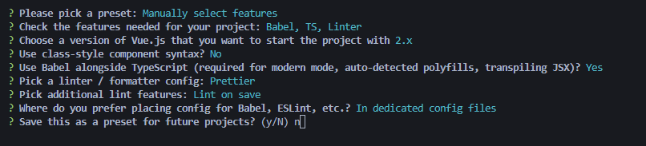
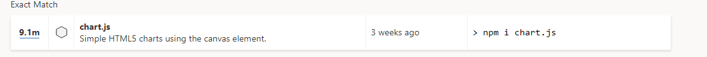

# 뷰 플러그인과 외부 라이브러리 타입 정의

## 프로젝트 생성 및 라이브러리 안내

외부라이브러리를 플러그인화 하고, 그 플로그인의 타입정의 하는 방법을 알아보자.

```shell
vue create vue-chart
```



생성 후 vue-chart로 이동하여 `npm run serve`로 잘 동작하는지 확인.

차트 라이브러리로는 Chart.js를 사용.


## 차트 라이브러리 설치 및 실행 확인

[Chart.js](https://www.chartjs.org/)

```shell
npm i chart.js --save
```

확인해보자.


우선 App.vue에서 ts자동완성 명령어를 이용해 새로 작성.

그리고 mounted에 chart.js에서 예제 파일을 붙여넣음.<br/>(잘 되지않아 커뮤니티에 검색해보니 예제코드를 붙여주신분이 있어 해당 코드를 사용.)

```vue
<template>
  <div>
    <canvas id="myChart"></canvas>
  </div>
</template>
<script lang="ts">
import Vue from "vue";
import { ChartConfiguration } from "chart.js";
import Chart from "chart.js/auto";

export default Vue.extend({
  mounted() {
    const labels = ["January", "February", "March", "April", "May", "June"];
    const data = {
      labels: labels,
      datasets: [
        {
          label: "My First dataset",
          backgroundColor: "rgb(255, 99, 132)",
          borderColor: "rgb(255, 99, 132)",
          data: [0, 10, 5, 2, 20, 30, 45],
        },
      ],
    };
    const config: ChartConfiguration = {
      type: "line",
      data,
      options: {},
    };
    const ctx = (
      document.getElementById("myChart") as HTMLCanvasElement
    ).getContext("2d") as CanvasRenderingContext2D;
    var myChart = new Chart(ctx, config);
  },
});
</script>
<style scoped></style>
```

`document.getElementById("myChart").getContext("2d");` 여기서 에러가 발생할텐데 getContext앞의 요소가 canvas요소인것을 추론할 수 있게 해주어야한다.

가장 간단한 방법으로는 HTMLCanvasElement라고 선언해준다.

```typescript
 const ctx = (
      document.getElementById("myChart") as HTMLCanvasElement
    ).getContext("2d");
```


## 차트 라이브러리 에러 설명 및 플러그인화

chart.js라이브러리를 typescript로 인식하지 못하는 문제가 발생하고 있다.

vue-chart가 루트레벨로 보이게 워크스페이스를 다시 열어주자.

일단 새로운 선언파일이 필요하다고 에러가 출력되고 있다.

어떤 에러인지 살펴보았으니 우선 chart.js의 플러그인화를 진행해보자.

```typescript
// src/plugins/ChartPlugin.ts
import Chart from "chart.js";

export default {
  install(Vue) {
    Vue.prototype.$_Chart = Chart;
  },
};

// App.vue
// new this.$_Chart();
```

App.vue에서는 주석된 부분처럼  차트를 생성할 수 있게 된다.


## 차트 플러그인 타입 에러 해결

install부분 부터 살펴보자.

```typescript
install(Vue) {
    Vue.prototype.$_Chart = Chart;
},
```

Vue는 Vue 내부적으로 제공하는 VueConstructor를 사용하면된다.

그리고 강의에서는 

```typescript
 Vue.prototype.$_Chart
```

이부분이 typescript 내부의 규칙에 의해서 camelCase가 아니라는 에러가난다.

eslint에 rules에 해당내용을 off로해주면 된다. (설정값으로는 off/warn/error가 있다.)

```typescript
"@typescript-eslint/camelcase": "off",
```


강의에서 import chart.js에 에러가 발생한다. ()

공식 사이트에서 제공하는 타입선언 라이브러리를 검색하여 설치.

@types/chart.js를 npm으로설치.

( 최근에는  따로 설치하지 않아도 되도록 수정된 듯 하다.)



참고 : 

[타입스크립트 타입 선언 라이브러리 검색 페이지](https://www.typescriptlang.org/dt/search?search=chart.js)

[Definitely Typed](https://github.com/DefinitelyTyped/DefinitelyTyped)


## 뷰 컴포넌트의 차트 관련 타입 에러 해결

npm run serve로 확인해보면 App.vue쪽에 에러가 나고 있다. 

ctx라는 것이 null일 수 있기 때문에 발생한 에러다.

에러 내용을 잘 살펴보면, `Argument of type 'CanvasRenderingContext2D | null'`.

CanvasRenderingContext2d거나 null일 수 있다.는 내용.

이전에 선언한 myChart를 **non-Null assertion 타입**을 이용해 선언할 수 도 있다.

정석적인 방법으로는

```typescript
 const canvasElement = document.getElementById(
      "myChart"
    ) as HTMLCanvasElement;
const ctx = canvasElement.getContext("2d");
```

canvasElement를 선언 하여 사용하면, getContext에 생성되던 error도 삭제됨.

ctx의 에러는 타입가드를 통해 막을 수 있다.

```typescript
if (ctx === null) {
    return;
}
```

결론적으로 ctx는 null이거나 CanvasRenderingContext2D일 수 있지만, ctx가 null일 때 return해버리기 때문에 막을 수 있다.

실행시키면 브라우저 콘솔에서 아래 같은 에러가 발생한다.

```text
 "line" is not a registered controller
```

import 를 chart.js 대신 chart.js/auto를 해주어 고쳐주니 정상작동하였다.

[line is not a registered controller-stackoverflow](https://stackoverflow.com/questions/67060070/chart-js-core-js6162-error-error-line-is-not-a-registered-controller)


## 플러그인 적용 후 타입 에러 확인

main.ts에서 차트플러그인을 들고와보자.

```typescript
import Vue from "vue";
import App from "./App.vue";
import ChartPlugin from "./plugins/ChartPlugin";

Vue.use(ChartPlugin);
Vue.config.productionTip = false;

new Vue({
  render: (h) => h(App),
}).$mount("#app");
```

Vue.use를 통해서 ChartPlugin에서 작성한 코드가 동작한다.

플러그인을 전역개념으로 사용한 것도 있지만, 애플리케이션의 성격에 맞게 공통 스타일을 적용할 수도 있고, 서비스 이용에 특화된 커스텀 속성들을 관리하기에 용이하다.

이제 App.vue로 가보자.

`import Chart from "chart.js";`가 아니라 this.$_Chart를 이용해 생성할 것이다.

```vue
...
<script lang="ts">
// import Chart from "chart.js/auto";
import Vue from "vue";

export default Vue.extend({
  mounted() {
    ...
    const myChart = new this.$_Chart(ctx, {
      type: "line",
        ...
```


## 플러그인 속성 타입 에러 해결

this.$_Chart에서  제대로 추론되지 않아 에러가 발생하고 있다.

vue 공식문서를 가게 되면 TypeScript 사용에 대한 설명을 해놓았다. 참고!

[vue 공식문서 - typescript](https://v2.vuejs.org/v2/guide/typescript.html) - (vuejs.org 말고, vue2 docs로 가서 봐야함.)

Agumenting Types for Use with Plugins를 보자.

```typescript
// 1. Make sure to import 'vue' before declaring augmented types
import Vue from 'vue'

// 2. Specify a file with the types you want to augment
//    Vue has the constructor type in types/vue.d.ts
declare module 'vue/types/vue' {
  // 3. Declare augmentation for Vue
  interface Vue {
    $myProperty: string
  }
}
```

위 내용을 src폴더 밑에 types폴더를 만들고, project.d.ts로 작성.

그 후 tsconfig.json에 등록.

```json
...
"include": [
    "src/**/*.ts",
    "src/**/*.tsx",
    "src/**/*.vue",
    "tests/**/*.ts",
    "tests/**/*.tsx",
    "src/types/*.d.ts"
  ],
...
```


project.d.ts파일을 우리가 사용하려는 형태로 수정.

```typescript
// 1. Make sure to import 'vue' before declaring augmented types
import Vue from "vue";
import Chart = require("chart.js");

// 2. Specify a file with the types you want to augment
//    Vue has the constructor type in types/vue.d.ts
declare module "vue/types/vue" {
  // 3. Declare augmentation for Vue
  interface Vue {
    $_Chart: Chart;
  }
}
```

여전히 생성자형태로 만들 수 없다. (현재화면에서 any로 잡힘)

project.d.ts에 Chart type을 한번 감싸서 작성하면, 제대로 추론된다.

```typescript
// 1. Make sure to import 'vue' before declaring augmented types
import Vue from "vue";
import Chart = require("chart.js");

type ChartLib = typeof Chart;
// 2. Specify a file with the types you want to augment
//    Vue has the constructor type in types/vue.d.ts
declare module "vue/types/vue" {
  // 3. Declare augmentation for Vue
  interface Vue {
    $_Chart: ChartLib;
  }
}
```

(현재 스펙이 조금 바뀐듯하다.)


## 외부 라이브러리 타입 정의 방법 정리

chart.js뿐만 아니라 @types가 없는 라이브러리도 사용이 가능하다.

```typescript
// @types 라이브러리가 제공되지 않는 라이브러리의 경우
// declare module "라이브러리 이름";
// interface의 경우 타입을 any로 해서 사용이 가능

declare module "vue/types/vue" {
  // 3. Declare augmentation for Vue
  interface Vue {
    $_Chart: any;
  }
}
```

