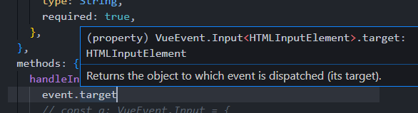

# 뷰 이벤트 커스텀 타입 정의

## 이벤트 타입 정의가 필요한 이유 소개

 이전에 사용했던 vue-todo에서 TodoInput을 보면 input이벤트를 사용하고 있다.

```typescript
<template>
  <div>
    <label for="todo-input"></label>
    <input id="todo-input" type="text" :value="item" @input="handleInput" />
    <button @click="addTodo" type="button">추가</button>
  </div>
</template>
<script lang="ts">
import Vue from "vue";
export default Vue.extend({
  // props: ["item"],
  props: {
    item: {
      type: String,
      required: true,
    },
  },
  methods: {
    handleInput(event: InputEvent) {
      // console.log(event);
      // if (!event.target) {
      //   return;
      // }
      const eventTarget = event.target as HTMLInputElement;
      this.$emit("input", eventTarget.value);
    },
    addTodo() {
      this.$emit("add");
    },
  },
});
</script>

```

event.target.value를 하면 target이없기때문에 return으로 벗겨내거나 as를 사용해 타입을 선언했었다.

as나 타입가드가 아닌 event를 타입정의할때 매끄럽게 사용할 수 있게 해보자.


## 뷰 이벤트 타입 정의를 위한 네임스페이스 생성

한번에 타입정의를 해서 반복적인 코드를 없에보자.

event.target.value를 쳐보면 내부적으로 이미 event.target이 EventTarget이라고 타입이 정의가 되어있다. -> 바꿀수 없다. 그래서 **custom타입을 만들어서 활용.**

전역으로 namespace를 이용할 것이다.

InputEvent는 이미 내부적으로 선언된 타입이기 때문에 이를 확장해 Input을 작성 할 것이다.

```typescript
export namespace VueEvent {
  export interface Input extends InputEvent{
    target: null;
  }
}
```

TodoInput.vue에서 VueEvent를 들고와보자.

```typescript
const a: VueEvent.Input = {
    target // null
}
```

a의 VueEvent는 namespace의 VueEvent로 초기화했고, 안에서 target을 쓰게되면 custom타입으로 null로 정의했기때문에 target이 null로 잡히는 것을 볼 수 있다.


## 뷰 이벤트 타입 정의

Input에다가 제네릭을 한번 적용해보자

```typescript
export namespace VueEvent {
  export interface Input<T> extends InputEvent{
    target: T;
  }
}
```

이렇게되면 에러가 발생한다.

타입의 위계를 살펴보면 아래와 같다.

```text
타입의 위계
Event
UIEvent
InputEvent
```

Event까지 가보면 target속성이 정의가 되있다.

target의 타입을 확장해서 사용하는 방식으로 가야한다

```typescript
export namespace VueEvent {
  export interface Input<T extends EventTarget> extends InputEvent{
    target: T;
  }
}
```


이제 메서드를 아래처럼 고쳐보자.

```vue
handleInput(event: VueEvent.Input) {
	...
}
```

이러면 에러가 발생하는데 VueEvent의  Input은 제네릭을 무조건 받게 되어있기 때문이다.

제네릭으로 input Element를 넣어주게 되면 event.target을 썻을때 타입추론이 되는 것을 볼 수 있다.

```vue
handleInput(event: VueEvent.Input<HTMLInputElement>) {
    event.target
    ...
}
```



HTMLInputElement가 되기때문에 event.target.value로 바로 접근할 수 있게 된다.


keyboard이벤트나 Mouse이벤트의 경우도 KeyboardEvent로 만들 수 있다.

```typescript
export interface Keyboard<T extends EventTarget> extends KeyboardEvent{
    target: T;
}
```

