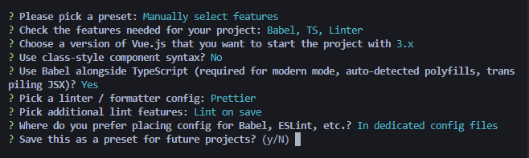

# 16. Vue3

[Vue3의 Vuex 타입 정의 방법 안내](https://vuex.vuejs.org/guide/typescript-support.html)


```shell
vue create vue3-ts
```

아래와 같이 설정 후 설치.



vue3에서는 vue extend대신 **defineComponent**를 사용

```vue
<template>
  
  <HelloWorld msg="Welcome to Your Vue.js + TypeScript App" />
</template>

<script lang="ts">
import { defineComponent } from "vue";
import HelloWorld from "./components/HelloWorld.vue";

export default defineComponent({
  name: "App",
  components: {
    HelloWorld,
  },
});
</script>
```

```vue
<script lang="ts">

export default defineComponent({
  name: "App",
  components: {
    HelloWorld,
  },
  data() {
    return {
      str: "hi",
    };
  },
  methods: {
    changeStr() {
      this.str = "!!!";
    },
  },
});
</script>
```

this.str까지 쳤을 때 string으로 타입이 잡힘